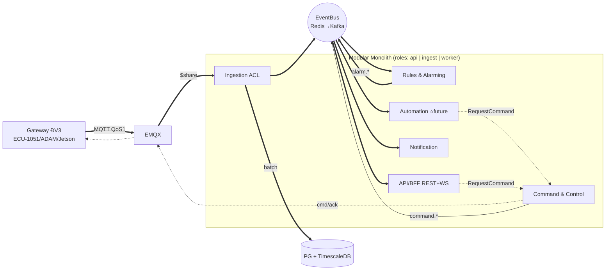

# DDD Bounded Context Map — IIoT Platform (POC → Production)

**Version:** 1.0 (2026-07-24) · **Nguồn:** `plans/reports/brainstorm-260724-0942-ddd-eda-bounded-context-design-poc-to-production-report.md`
**Phạm vi:** hợp thức hóa layout `apps/backend/internal/` theo DDD + thiết kế Automation Engine (design-only POC) + lộ trình evolution. KHÔNG thay đổi D1–D7 (`system-architecture.md`) và scope POC (`plans/260723-1450-*`).

---

## 1. Bounded Contexts — map 1:1 lên modules

| Bounded Context | Module | Aggregate / State machine | Loại | Tương lai |
|---|---|---|---|---|
| Telemetry Ingestion (ACL) | `internal/ingest` | stateless: decode, validate IA, dedup seq, backfill flag | Supporting | Service tách #1 |
| Telemetry Store & Query | `internal/telemetry` | TimeSeries (hypertable) + last-value (Redis); CQRS | Supporting | Swap ClickHouse (D2) |
| Rules & Alarming | `internal/rules` | **Alarm**: open→acked→closed | **Core** | Service tách #2 |
| Automation & Workflow | `internal/automation` ⭐ sau POC | **AutomationRule** (ECA) · **WorkflowRun** | **Core** | Temporal workers (D2) |
| Command & Control | `internal/control` | **Command**: pending→sent→acked/failed/timeout | **Core** | Service tách #4 (safety isolation) |
| Device Registry | `internal/device` | **Device/Gateway**: heartbeat→online/offline | Supporting | Module lâu dài |
| Camera & Vision | `internal/camera` | Camera; AI event normalize vào pipeline chung | Supporting | Module lâu dài |
| Notification | `internal/jobs` (notify) | Delivery: dedup, escalation, durable PG queue | Supporting | Worker tách theo jobs |
| Identity & Access | `internal/auth` | User/Role RBAC | Generic | → Keycloak (D2) |
| Audit / Analytics / Tenancy | bảng audit · Grafana · policy D6 | — | Generic | Event consumer production |

`internal/api` = composition layer (REST + WS hub), KHÔNG phải bounded context. `internal/events` = infra EventBus.

## 2. Nguyên tắc quan hệ giữa contexts

1. **Ingestion là ACL duy nhất** chạm wire format Interface Agreement — contexts khác chỉ thấy `TelemetryPoint` (Published Language, `internal/events/types.go`).
2. **Command context = một cửa an toàn:** mọi actor (user, automation) phát lệnh qua whitelist + idempotency + audit. Không ai publish MQTT `cmd` trực tiếp ngoài `internal/control`.
3. **Rules DETECT, Automation ACT** — 2 contexts riêng: rules eval stateless → alarm; automation orchestrate stateful → command.
4. **EMQX = device plane ONLY** — không bao giờ dùng làm inter-service bus. Domain events đi EventBus (Redis POC → Kafka production).
5. Mặc định **async giữa contexts**; sync chỉ cho user-facing reads + validation tại điểm phát lệnh (trả `pending`, kết quả về qua WS).

## 3. Sơ đồ tương tác

## 4. Event catalog (rút gọn)

| Event | Producer → Consumers | Durable | POC / Production |
|---|---|---|---|
| `telemetry.received` | Ingest → Rules, Automation, WS | Không | `rt:telemetry` / `telemetry.raw` key=device_id |
| `device.online/offline` | Device → Rules, Automation, WS | Không | — / `domain.device-state` compacted |
| `alarm.raised/acked/cleared` | Rules → Notification, Automation, WS, Audit | **Có** (outbox) | `rt:alarm` / `domain.alarms` |
| `command.requested/sent/acked/failed/timeout` | Control → WS, Audit, Automation | **Có** | `rt:command` / `domain.commands` compacted |
| `automation.triggered` · `workflow.*` | Automation → Audit, WS | **Có** | future / `domain.automation` |

**Commands (imperative — KHÔNG pub/sub):** `RequestCommand`, `EnqueueNotification` (PG River queue), `StartWorkflow` (Temporal production). **Queries (sync):** REST read models, Redis last-value, TSDB history.

## 5. Automation Engine — 3 lớp (design-only POC)

- **L1 Detection** (`internal/rules`, POC Phase 3): threshold/window eval → AlarmEvent, ≤2s.
- **L2 ECA** (`internal/automation`, sau POC): Trigger (event pattern/schedule) → Condition (last-value, calendar, interlock, cooldown) → Action (RequestCommand, EnqueueNotification, StartWorkflow, webhook). Definitions PG versioned + execution log.
- **L3 Workflow** (Temporal, production D2): multi-step durable — escalation, maintenance sequence, human-approval. Seam: interface `WorkflowEngine`.

**Safety invariants:** một cửa Command context (actor=`automation:{rule_id}`) · loop protection (cooldown + rate limit + cycle detection) · manual override thắng automation · kill-switch toàn cục · dry-run cho rule mới.

## 6. Kỷ luật giữ seam (bắt buộc từ Phase 2)

1. **Module owns its tables — cấm cross-context SQL JOIN**; truy cập chéo qua Go interface.
2. FK cross-context: chấp nhận POC nhưng document (dự kiến giữ: alarm→device, command→device).
3. Event schema **additive-only**, cấm rename field; wire format giữ `v1/`.
4. Stage 1: thêm depguard/go-arch-lint CI chặn import chéo `internal/*`.

## 7. Evolution roadmap — 5 stage reversible

| Stage | Việc | Seam | Map roadmap |
|---|---|---|---|
| 0 | Monolith roles + Redis bus + 1 PG (hiện tại, Phase 1/8 ✓) | — | POC |
| 1 | PG outbox durable events · schema additive-only · arch lint | `internal/events` | POC cuối / A |
| 2 | EventBus impl Kafka, shadow-run | EventBus interface | A |
| 3 | Extract: ingest → rules → automation (Temporal) → control | role dispatch | B |
| 4 | Telemetry → ClickHouse; DB-per-service cho service đã tách | TelemetryStore interface | B |
| 5 | Keycloak · Temporal · K8s CHỈ cloud (VKS); site giữ Compose (D7) | auth/workflow interfaces | B/C |

**Lưu ý:** microservices là trạng thái đến của **cloud platform**; on-prem site giữ Docker Compose theo D7 — monolith roles trên Compose là kiến trúc đúng cho site, không phải nợ kỹ thuật.
