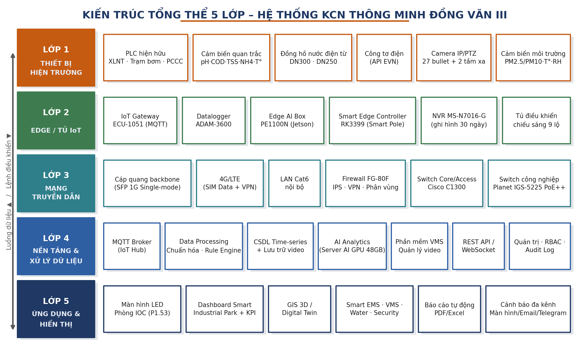
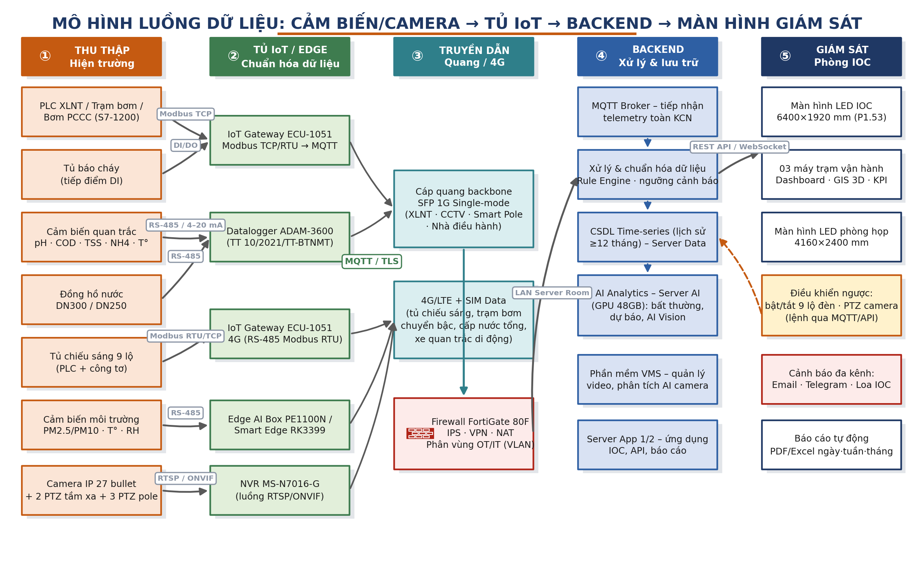
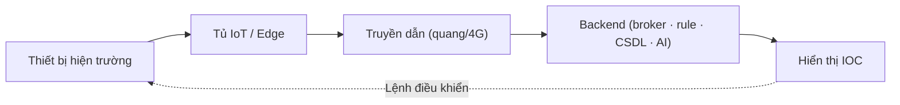
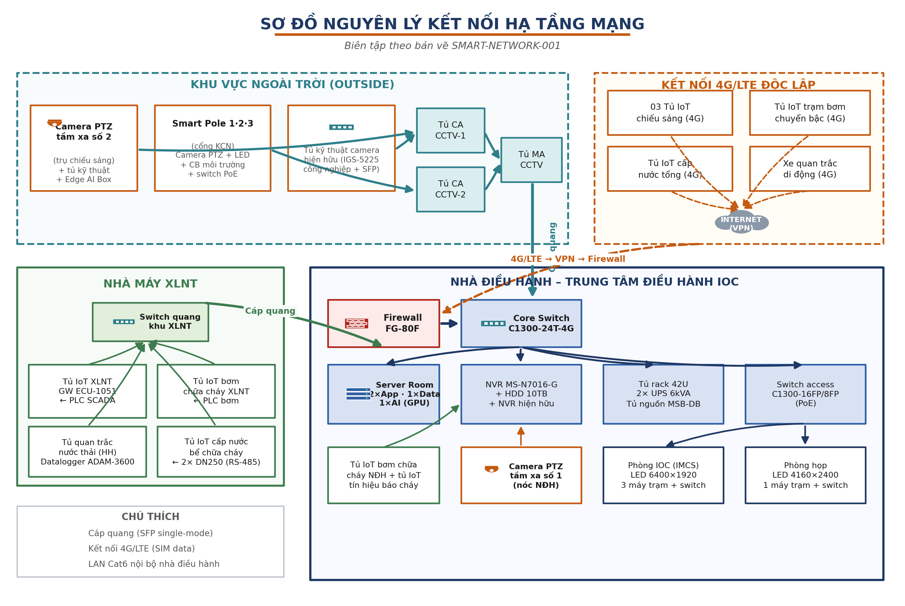
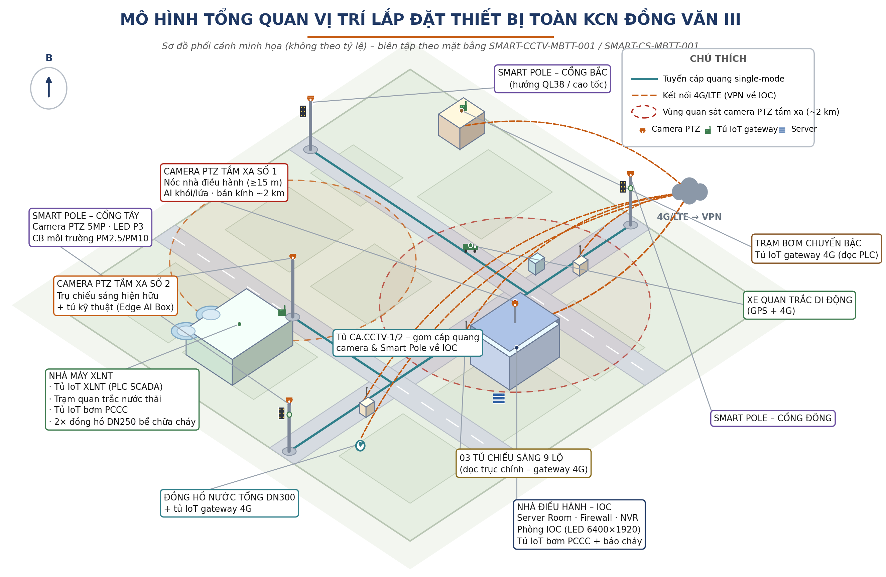
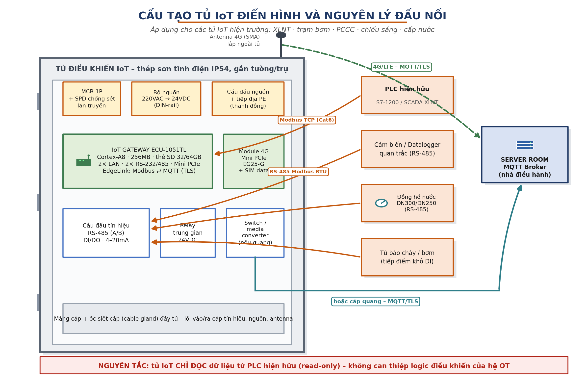
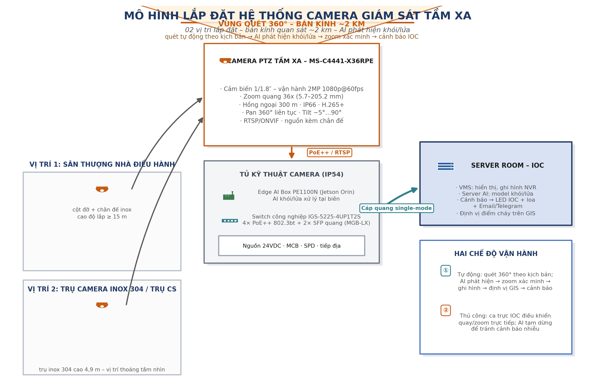
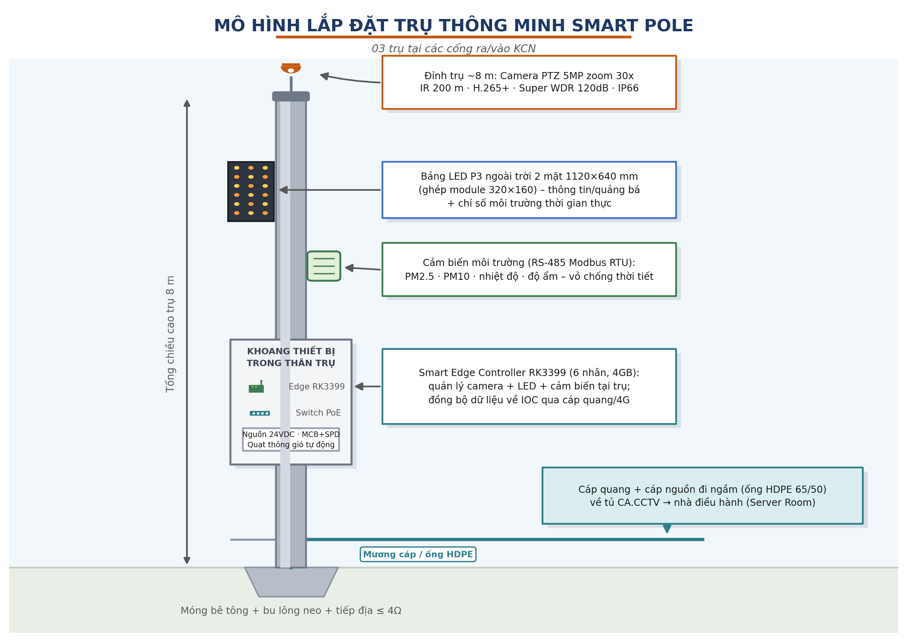

<!-- Page 1 -->

**Báo cáo kỹ thuật – Hệ thống KCN thông minh Đồng Văn III**

TÀI LIỆU KỸ THUẬT ĐỘC LẬP — Biên soạn phục vụ nghiên cứu – thiết kế – triển khai hệ thống

# BÁO CÁO KỸ THUẬT THI CÔNG LẮP ĐẶT HỆ THỐNG QUẢN LÝ VẬN HÀNH THÔNG MINH (IOC) KHU CÔNG NGHIỆP HỖ TRỢ ĐỒNG VĂN III – PHÍA ĐÔNG CAO TỐC CẦU GIẼ – NINH BÌNH

Mô hình lắp đặt thiết bị – Thiết bị hạ tầng – Thông số kỹ thuật – Luồng dữ liệu giám sát

Căn cứ hồ sơ thiết kế – thuyết minh kỹ thuật của dự án và hồ sơ bản vẽ thi công (Rev.00 – 29/01/2026)

Phiên bản 1.1 · Tháng 07/2026

<!-- Page 2 -->

## Mục lục

- MỤC LỤC
- 1. TỔNG QUAN DỰ ÁN
  - 1.1. Thông tin chung
  - 1.2. Phạm vi kỹ thuật
  - 1.3. Tài liệu căn cứ
- 2. KIẾN TRÚC TỔNG THỂ HỆ THỐNG
  - 2.1. Mô hình kiến trúc 5 lớp
  - 2.2. Nguyên tắc thiết kế chủ đạo
- 3. MÔ HÌNH LUỒNG DỮ LIỆU: THU THẬP → TỦ IoT → BACKEND → GIÁM SÁT
  - 3.1. Sơ đồ luồng dữ liệu tổng quát
  - 3.2. Bảng chỉ số thu thập theo phân hệ
  - 3.3. Luồng video và phân tích AI
  - 3.4. Luồng điều khiển ngược và cơ chế cảnh báo
- 4. HẠ TẦNG MẠNG TRUYỀN DẪN VÀ AN NINH MẠNG
  - 4.1. Kiến trúc mạng
  - 4.2. Quy hoạch kết nối theo khu vực
  - 4.3. An ninh mạng
- 5. MÔ HÌNH LẮP ĐẶT CHI TIẾT THEO PHÂN HỆ
  - 5.1. Cấu tạo tủ IoT điển hình
  - 5.2. Phân hệ quản lý môi trường
  - 5.3. Phân hệ quản lý an ninh – PCCC
  - 5.4. Phân hệ quản lý năng lượng – nước cấp
  - 5.5. Trung tâm điều hành IOC và phòng server
  - 5.6. Hạ tầng phụ trợ thi công
- 6. THÔNG SỐ KỸ THUẬT CHI TIẾT THIẾT BỊ
  - 6.1. Thiết bị thu thập dữ liệu và gateway
  - 6.2. Cảm biến và thiết bị đo lường
  - 6.3. Camera và thiết bị AI
  - 6.4. Thiết bị hạ tầng mạng
  - 6.5. Máy chủ, máy trạm và màn hình
  - 6.6. Nguồn, tủ rack và thiết bị phụ trợ
- 7. NỀN TẢNG PHẦN MỀM VÀ XỬ LÝ DỮ LIỆU TẠI BACKEND
  - 7.1. Nền tảng quản lý – điều hành tập trung (IOC)
  - 7.2. Phần mềm quản lý video (VMS) và AI
  - 7.3. Phần mềm phân hệ chuyên biệt
  - 7.4. Chính sách dữ liệu, phân quyền và giới hạn nền tảng
- 8. TIẾN ĐỘ, NGHIỆM THU, BẢO HÀNH VÀ VẬN HÀNH
  - 8.1. Tiến độ thực hiện tham chiếu
  - 8.2. Nghiệm thu

<!-- Page 3 -->

- (tiếp) 8. TIẾN ĐỘ, NGHIỆM THU, BẢO HÀNH VÀ VẬN HÀNH
  - 8.3. Bảo hành thiết bị
  - 8.4. Hạng mục duy trì thường xuyên (từ năm thứ 2)
- PHỤ LỤC A. BẢNG TỔNG HỢP KHỐI LƯỢNG THIẾT BỊ TOÀN DỰ ÁN
- PHỤ LỤC B. DANH MỤC HỒ SƠ BẢN VẼ THI CÔNG (REV.00 – 29/01/2026, KHỔ A3)

<!-- Page 4 -->

## 1. TỔNG QUAN DỰ ÁN

### 1.1. Thông tin chung

| Hạng mục | Nội dung |
| --- | --- |
| Tên hệ thống | Hệ thống quản lý – vận hành thông minh (IOC) cho Khu công nghiệp Đồng Văn III: giám sát tập trung môi trường, an ninh, năng lượng, nước và hạ tầng CNTT |
| Địa điểm triển khai | KCN hỗ trợ Đồng Văn III, phía Đông cao tốc Cầu Giẽ – Ninh Bình (quy mô hiện hữu ~130 ha, có định hướng mở rộng) |
| Phạm vi hệ thống | 04 phân hệ (môi trường, an ninh – PCCC, năng lượng – nước, trung tâm điều hành) + hạ tầng truyền dẫn quang/4G + nền tảng phần mềm IOC |
| Tiến độ tham chiếu | Giao thiết bị 8–12 tuần kể từ khi đặt hàng; thi công lắp đặt 8–10 tuần kể từ khi đủ điều kiện mặt bằng (tổng thể dự kiến ~4 tháng) |
| Nền tảng phần mềm | Nền tảng quản lý – điều hành tập trung (Smart Industrial Park) + phần mềm quản lý video (VMS) + các phân hệ Smart EMS/Water/Security – triển khai tại phòng điều hành IOC (IMCS) và phòng họp nhà điều hành |
| Mục đích tài liệu | Trình bày mô hình lắp đặt thiết bị, danh mục thiết bị hạ tầng, thông số kỹ thuật đầy đủ và mô hình luồng dữ liệu từ cảm biến/camera qua tủ IoT về backend và màn hình giám sát |

### 1.2. Phạm vi kỹ thuật

Dự án triển khai lắp đặt thiết bị hiện trường, tủ IoT, hạ tầng truyền dẫn và trung tâm điều hành; kết nối toàn bộ dữ liệu vận hành của KCN về nền tảng quản lý – điều hành tập trung tại phòng IOC, gồm bốn phân hệ chính:

- **Quản lý môi trường:** kết nối SCADA nhà máy xử lý nước thải (XLNT), tích hợp trạm quan trắc nước thải đầu ra, tủ IoT trạm bơm chuyển bậc thoát nước thải, hệ thống quan trắc – lấy mẫu di động trên xe chuyên dụng và quan trắc nước thải khách hàng.
- **Quản lý an ninh:** tích hợp 27 camera bullet hiện hữu và bổ sung lớp AI cảnh báo; đầu tư 02 camera PTZ giám sát tầm xa (AI khói/lửa, bán kính ~2 km); giám sát bơm chữa cháy và tín hiệu báo cháy (PCCC); 03 trụ thông minh Smart Pole tại các cổng KCN.
- **Quản lý năng lượng:** cải tạo 03 tủ điều khiển chiếu sáng lên 9 lộ/tủ điều khiển từ xa; tích hợp công tơ tổng qua API EVN; đồng hồ nước điện từ DN300 cấp nước tổng và 02 đồng hồ DN250 bể chữa cháy; sẵn sàng tích hợp đồng hồ nước khách hàng.
- **Trung tâm điều hành và hạ tầng CNTT:** phòng server (04 máy chủ, NVR, tường lửa, tủ rack 42U, 02 UPS 6 kVA), phòng IOC (màn hình LED, 03 máy trạm), phòng họp (màn hình LED, máy trạm), hệ thống âm thanh thông báo và GIS 3D/Digital Twin toàn KCN.

### 1.3. Tài liệu căn cứ

- Bảng chi tiết khối lượng thiết bị và hạng mục công việc của dự án.
- Thuyết minh giải pháp kỹ thuật thi công lắp đặt kèm bộ tiêu chí nghiệm thu phần mềm.
- Hồ sơ 22 bản vẽ thi công Rev.00 ngày 29/01/2026 (SMART-NETWORK-001, SMART-SDNL-001, chi tiết tủ IoT, Smart Pole, camera PTZ, IOC… – danh mục tại Phụ lục B).
- Tài liệu giải pháp trụ thông minh tích hợp Smart Pole.
- Thông số kỹ thuật công bố của hãng sản xuất (Advantech, Milesight, Asus, Cisco, Planet, Fortinet, Dell, HPE, Eaton, Seagate…). Mã hàng nêu trong tài liệu là tham chiếu ở dạng “hoặc tương đương”.

<!-- Page 5 -->

## 2. KIẾN TRÚC TỔNG THỂ HỆ THỐNG

### 2.1. Mô hình kiến trúc 5 lớp

Hệ thống được tổ chức theo kiến trúc 5 lớp: thiết bị hiện trường → tủ IoT/Edge → mạng truyền dẫn → nền tảng xử lý dữ liệu (backend) → ứng dụng hiển thị. Dữ liệu vận hành đi từ dưới lên để giám sát; lệnh điều khiển (bật/tắt lộ đèn, quay/zoom camera PTZ) đi từ trên xuống theo phân quyền.

*Hình 2.1 – Kiến trúc tổng thể 5 lớp của hệ thống KCN thông minh Đồng Văn III*

- **Lớp 1 – Thiết bị hiện trường:** PLC hiện hữu (SCADA XLNT, trạm bơm S7-1200, bơm PCCC), cảm biến quan trắc nước thải (pH, COD, TSS, NH4, nhiệt độ), đồng hồ nước điện từ DN300/DN250, công tơ điện (qua API EVN), camera IP/PTZ, cảm biến môi trường không khí, bảng LED, loa.
- **Lớp 2 – Edge/Tủ IoT:** IoT Gateway Advantech ECU-1051 làm bộ chuyển đổi Modbus ⇄ MQTT thống nhất cho mọi phân hệ (đệm dữ liệu cục bộ 30 ngày trên thẻ SD); Datalogger ADAM-3600 cho trạm quan trắc theo Thông tư 10/2021/TT-BTNMT; Edge AI Box Asus PE1100N xử lý AI khói/lửa tại biên; Smart Edge Controller RK3399 điều phối thiết bị trên Smart Pole; NVR ghi hình tập trung.
- **Lớp 3 – Mạng truyền dẫn:** cáp quang backbone (SFP 1G single-mode) cho các điểm cố định lưu lượng lớn; 4G/LTE cho các vị trí phân tán khó kéo cáp; LAN Cat6 trong nhà điều hành; toàn bộ lưu lượng đi qua tường lửa FortiGate 80F.
- **Lớp 4 – Nền tảng backend:** MQTT Broker tiếp nhận telemetry; dịch vụ chuẩn hóa dữ liệu và Rule Engine đánh giá ngưỡng cảnh báo; cơ sở dữ liệu time-series lưu lịch sử ≥ 12 tháng; Server AI (GPU 48 GB) chạy mô hình phân tích bất thường, dự báo và AI Vision; phần mềm VMS quản lý video; API Gateway cung cấp REST API/WebSocket.
- **Lớp 5 – Ứng dụng & hiển thị:** Dashboard Smart Industrial Park (KPI, GIS 3D/Digital Twin), các phần mềm phân hệ Smart EMS/VMS/Water/Security, màn hình LED phòng IOC và phòng họp, báo cáo tự động PDF/Excel, cảnh báo đa kênh (màn hình, email, Telegram, loa).

### 2.2. Nguyên tắc thiết kế chủ đạo

<!-- Page 6 -->

- **Chỉ đọc (read-only) đối với hệ OT hiện hữu:** tủ IoT chỉ đọc dữ liệu từ PLC của nhà máy XLNT, trạm bơm và bơm PCCC, tuyệt đối không ghi đè logic điều khiển – bảo vệ an toàn vận hành của hệ thống hiện hữu. Chỉ hai đối tượng cho phép điều khiển từ xa: 9 lộ chiếu sáng (qua PLC tủ chiếu sáng) và camera PTZ (qua ONVIF).
- **Chuẩn mở, tránh khóa nhà cung cấp:** toàn bộ giao tiếp dùng Modbus RTU/TCP, MQTT, RTSP/ONVIF, REST API; nền tảng hỗ trợ mở rộng OPC UA. Camera tương thích ONVIF đa hãng (Hikvision, Axis, Milesight, Dahua…).
- **Đệm dữ liệu tại biên:** gateway lưu dữ liệu cục bộ tới 30 ngày, tự động truyền bù khi mất kết nối – chống mất dữ liệu trên đường truyền 4G.
- **Phân tách IT/OT và phòng thủ theo lớp:** firewall + VLAN + VPN cho kết nối 4G; xác thực thiết bị; TLS cho MQTT; RBAC và audit log ở tầng ứng dụng.
- **Khả năng mở rộng:** nền tảng hỗ trợ tới 5.000 I/O, 300 camera CCTV, 40 camera AI – dự phòng cho giai đoạn mở rộng KCN mà không đổi kiến trúc.

<!-- Page 7 -->

## 3. MÔ HÌNH LUỒNG DỮ LIỆU: THU THẬP → TỦ IoT → BACKEND → GIÁM SÁT

### 3.1. Sơ đồ luồng dữ liệu tổng quát

Chuỗi giá trị dữ liệu gồm 5 bước: (1) thiết bị hiện trường sinh dữ liệu; (2) tủ IoT/Edge đọc và chuẩn hóa về một định dạng thống nhất; (3) truyền dẫn qua cáp quang hoặc 4G có mã hóa; (4) backend tiếp nhận, xử lý luật cảnh báo, lưu trữ và phân tích AI; (5) hiển thị thời gian thực tại phòng IOC kèm cảnh báo đa kênh và báo cáo tự động. Lệnh điều khiển hợp lệ đi theo chiều ngược lại qua cùng hạ tầng.

*Hình 3.1 – Luồng dữ liệu từ cảm biến/camera qua tủ IoT về backend và màn hình giám sát IOC*

### 3.2. Bảng chỉ số thu thập theo phân hệ

Bảng dưới đây liệt kê đầy đủ các điểm đo, giao thức hiện trường, đường truyền và cơ chế cập nhật của từng nguồn dữ liệu:

| Nguồn dữ liệu | Chỉ số thu thập | Giao thức hiện trường | Đường truyền về IOC | Tần suất / cơ chế |
| --- | --- | --- | --- | --- |
| **A. PHÂN HỆ QUẢN LÝ MÔI TRƯỜNG** | | | | |
| SCADA/PLC nhà máy XLNT (hiện hữu) | Trạng thái chạy/dừng/lỗi của bơm, quạt, máy thổi khí; mực nước, lưu lượng, áp suất; sản lượng nước thải đã xử lý; sự kiện/cảnh báo thiết bị | Modbus TCP (đọc thanh ghi PLC) → gateway đóng gói MQTT | Cáp quang | Chu kỳ 1–5 s với trạng thái; đẩy tức thời khi đổi trạng thái/cảnh báo |
| Trạm quan trắc nước thải đầu ra (datalogger + cụm cảm biến) | pH (0–14), COD (0–500 mg/L), TSS (0–1300 mg/L), Amoni NH4 (0–20 mg/L), nhiệt độ (0–65 °C); trạng thái thiết bị đo | RS-485 Modbus RTU / 4–20 mA về datalogger | Cáp quang (dự phòng 4G) | 1–5 phút/bản ghi theo yêu cầu Thông tư 10/2021/TT-BTNMT; lưu đệm 30 ngày |

<!-- Page 8 -->

| Nguồn dữ liệu | Chỉ số thu thập | Giao thức hiện trường | Đường truyền về IOC | Tần suất / cơ chế |
| --- | --- | --- | --- | --- |
| Trạm bơm chuyển bậc thoát nước thải (PLC S7-1200) | Trạng thái bơm chạy/dừng, sự cố/cảnh báo, thông số vận hành, thống kê lượng nước thải bơm chuyển | Modbus TCP đọc PLC → MQTT | 4G/LTE (VPN) | 5–30 s; sự kiện đẩy tức thời |
| Xe quan trắc di động + quan trắc khách hàng | Bộ chỉ tiêu pH, COD, TSS, NH4, nhiệt độ tại điểm xả của doanh nghiệp; vị trí GPS của xe theo thời gian thực | RS-485 Modbus RTU → datalogger/bộ điều khiển đa thông số | 4G/LTE | Theo đợt quan trắc; GPS cập nhật liên tục khi xe hoạt động |
| **B. PHÂN HỆ QUẢN LÝ AN NINH – PCCC** | | | | |
| Camera hiện hữu 27 bullet + 03 PTZ Smart Pole | Luồng video H.265/H.264; sự kiện AI: dừng/đỗ sai quy định, đi ngược chiều, vật thể rơi, tụ tập/đánh nhau, xâm nhập khu vực cấm, tai nạn; đếm người/phương tiện, nhận diện biển số tại cổng | RTSP/ONVIF về NVR & nền tảng VMS; metadata sự kiện qua API/MQTT | Cáp quang | Video liên tục 24/7; sự kiện AI thời gian thực |
| 02 camera PTZ tầm xa (nóc nhà điều hành + trụ chiếu sáng) | Video toàn cảnh bán kính ~2 km; sự kiện AI phát hiện khói/lửa kèm tọa độ định vị trên GIS; trạng thái tuần tra tự động | RTSP/ONVIF; AI suy luận tại Edge AI Box, đẩy sự kiện MQTT/API | Cáp quang | Quét 360° theo kịch bản; cảnh báo tức thời khi phát hiện khói/lửa |
| Bơm chữa cháy XLNT + nhà điều hành; tủ tín hiệu báo cháy | Bơm chạy/dừng/lỗi; áp lực hệ (nếu có tín hiệu); tín hiệu báo cháy theo vùng; trạng thái chuông/còi/đèn | Đọc PLC bơm + tiếp điểm khô DI → MQTT | LAN/cáp quang (NĐH); quang (XLNT) | Sự kiện tức thời (<1 s) + heartbeat định kỳ giám sát kết nối |
| **C. PHÂN HỆ QUẢN LÝ NĂNG LƯỢNG – NƯỚC** | | | | |
| 03 tủ chiếu sáng 9 lộ (PLC + đo đếm điện) | Trạng thái ON/OFF từng lộ (9 lộ/tủ); điện áp, dòng điện, công suất, hệ số công suất, điện năng tiêu thụ (kWh); cảnh báo quá áp/sụt áp/quá dòng/quá tải/cosφ thấp/tiêu thụ bất thường | RS-485 Modbus RTU trong tủ → gateway MQTT | 4G/LTE (VPN) | 1–5 phút telemetry; lệnh bật/tắt & lịch chiếu sáng thực thi tức thời |
| Công tơ tổng EVN (tích hợp IT–IT) | Chỉ số điện năng tiêu thụ, sản lượng theo khung giờ của công tơ tổng KCN | REST API do EVN cung cấp (chủ đầu tư bàn giao quyền truy cập) | Internet | Đồng bộ theo chu kỳ dữ liệu EVN (15–30 phút/lần polling) |
| Đồng hồ nước DN300 (cấp nước tổng) + 2 × DN250 (bể chữa cháy XLNT) | Lưu lượng tức thời (m³/h), tổng lũy kế (m³); cảnh báo vượt ngưỡng, tiêu thụ bất thường/nghi rò rỉ so với lịch sử | RS-485 Modbus RTU (kèm ngõ 4–20 mA, xung) | 4G (đồng hồ tổng); quang (khu XLNT) | 1–5 phút; đối soát ngày/tháng phục vụ kiểm soát thất thoát |
| **D. MÔI TRƯỜNG KHÔNG KHÍ – SMART POLE** | | | | |
| Cảm biến môi trường trên Smart Pole | Bụi mịn PM2.5, PM10 (µg/m³); nhiệt độ; độ ẩm – hiển thị ngay trên bảng LED của trụ và dashboard IOC | RS-485 Modbus RTU → Smart Edge Controller | Cáp quang (dự phòng 4G) | 1–5 phút; cảnh báo vượt ngưỡng chất lượng không khí |

<!-- Page 9 -->

### 3.3. Luồng video và phân tích AI

Luồng video tách khỏi luồng telemetry để tối ưu băng thông: camera đẩy luồng RTSP/ONVIF qua switch công nghiệp PoE và cáp quang về NVR (ghi hình 2 MP trong tối đa 30 ngày) đồng thời về nền tảng VMS để hiển thị đa màn hình (tối đa 32 luồng/màn hình). Phân tích AI thực hiện ở hai tầng: (1) tại biên – Edge AI Box PE1100N chạy mô hình phát hiện khói/lửa cho camera tầm xa nhằm giảm độ trễ và băng thông; (2) tại trung tâm – Server AI (GPU 48 GB) chạy các mô hình an ninh – giao thông trên luồng camera hiện hữu. Sự kiện AI (ảnh chụp, loại sự kiện, thời gian, vị trí) được lưu tối đa 01 tháng và đẩy cảnh báo thời gian thực về IOC.

### 3.4. Luồng điều khiển ngược và cơ chế cảnh báo

- **Điều khiển chiếu sáng:** lệnh bật/tắt từng lộ hoặc lịch tự động được gửi từ IOC qua MQTT xuống gateway, gateway ghi xuống PLC tủ chiếu sáng; trạng thái phản hồi ngược để xác nhận thực thi; toàn bộ thao tác ghi audit log kèm người thực hiện.
- **Điều khiển camera PTZ:** thao tác quay/quét/zoom qua giao thức ONVIF từ phần mềm VMS, phân quyền theo vai trò ca trực.
- **Vòng đời cảnh báo:** phát hiện (rule engine/AI) → phân loại theo tối thiểu 3 mức ưu tiên → hiển thị IOC + gửi email/Telegram/loa → người trực xác nhận, chỉ định xử lý → đóng sự kiện kèm thời gian và người xử lý → lưu nhật ký phục vụ truy vết và thống kê KPI (theo bộ tiêu chí nghiệm thu phần mềm).

<!-- Page 10 -->

## 4. HẠ TẦNG MẠNG TRUYỀN DẪN VÀ AN NINH MẠNG

### 4.1. Kiến trúc mạng

Mạng truyền dẫn tổ chức theo mô hình hoa thị (hub-and-spoke) hội tụ về phòng server nhà điều hành: các cụm thiết bị ngoài trời (camera, Smart Pole) gom về 02 tủ cáp quang trung gian CA.CCTV-1/2 rồi về tủ MA.CCTV; khu XLNT dùng switch quang riêng; các tủ IoT phân tán (chiếu sáng, trạm bơm chuyển bậc, cấp nước tổng, xe quan trắc) kết nối 4G/LTE qua Internet có VPN về firewall. Trường hợp vị trí khó thi công hạ tầng, thiết kế cho phép chuyển đổi giữa quang và 4G mà không đổi kiến trúc.

*Hình 4.1 – Sơ đồ nguyên lý kết nối hạ tầng mạng (vẽ lại theo bản vẽ SMART-NETWORK-001)*

### 4.2. Quy hoạch kết nối theo khu vực

| Khu vực / cụm thiết bị | Phương thức kết nối | Thiết bị đầu mối | Ghi chú thi công |
| --- | --- | --- | --- |
| Nhà máy XLNT (tủ IoT XLNT, tủ IoT bơm PCCC, tủ quan trắc, tủ IoT cấp nước bể chữa cháy) | Cáp quang single-mode | Switch quang khu XLNT → core switch NĐH; SFP MGBLX1/MGB-LX | Tủ gắn tường 9U đặt tại XLNT; ống HDPE 65/50 luồn cáp |
| Tuyến camera hiện hữu + Smart Pole + camera tầm xa số 2 | Cáp quang single-mode + PoE/PoE++ nội cụm | Switch công nghiệp IGS-5225-4UP1T2S tại tủ kỹ thuật → tủ CA.CCTV-1/2 → tủ MA.CCTV | Tận dụng hào cáp hiện hữu; bổ sung mương cáp/ống HDPE đoạn thiếu (chi tiết bản vẽ SMART-CCTV-CT-004) |
| 03 tủ chiếu sáng, tủ trạm bơm chuyển bậc, tủ cấp nước tổng, xe quan trắc di động | 4G/LTE (05 SIM data) | Module 4G Mini PCIe (Quectel EG25-G) gắn trong gateway ECU-1051, antenna ngoài tủ | Kết nối VPN về firewall; gateway đệm dữ liệu 30 ngày khi mất sóng |

<!-- Page 11 -->

| Khu vực / cụm thiết bị | Phương thức kết nối | Thiết bị đầu mối | Ghi chú thi công |
| --- | --- | --- | --- |
| Nhà điều hành (server room, IOC, phòng họp, tủ IoT PCCC, camera tầm xa số 1) | LAN Cat6 (Commscope 1427254-6) | Core switch C1300-24T-4G; switch access C1300-16FP-2G/C1300-8FP-2G cấp PoE | Tủ rack 42U; UPS 6 kVA ×2; tủ nguồn MSB-DB |

### 4.3. An ninh mạng

- Tường lửa FortiGate 80F (bundle FortiCare + FortiGuard UTP) đặt tại biên mạng: NGFW, IPS/IDS, lọc web/ứng dụng, chống mã độc, SSL-VPN/IPsec-VPN cho kết nối 4G và truy cập quản trị từ xa.
- Phân vùng VLAN tách biệt OT (tủ IoT/PLC), hệ thống camera, máy chủ và mạng văn phòng; chính sách truy cập tối thiểu giữa các vùng.
- MQTT qua TLS, xác thực thiết bị bằng tài khoản/chứng thư riêng cho từng gateway; API bảo vệ bằng JWT; tài khoản người dùng phân quyền RBAC 3 nhóm (Admin/Operator/Viewer) và audit log đầy đủ.
- Datalogger quan trắc đạt ISO 27001 về quản lý an toàn thông tin; hệ thống hỗ trợ giám sát trạng thái kết nối và cảnh báo mất kết nối thiết bị.
- Quản trị tập trung, cập nhật firmware/bản vá theo kế hoạch bảo trì; sao lưu và khôi phục cấu hình hệ thống khi sự cố.

<!-- Page 12 -->

## 5. MÔ HÌNH LẮP ĐẶT CHI TIẾT THEO PHÂN HỆ

Sơ đồ phối cảnh dưới đây tổng hợp vị trí lắp đặt các cụm thiết bị chính trên mặt bằng KCN và phương thức truyền dẫn về trung tâm điều hành; chi tiết từng hạng mục được trình bày tại các mục 5.1 – 5.6.

*Hình 5.0 – Mô hình tổng quan vị trí lắp đặt thiết bị toàn KCN*

### 5.1. Cấu tạo tủ IoT điển hình

Tủ IoT là khối lắp đặt lặp lại của toàn dự án (9 tủ IoT hiện trường + tủ kỹ thuật camera). Tủ thép sơn tĩnh điện IP54, gắn tường/trụ, cấu tạo chuẩn gồm: MCB bảo vệ + chống sét lan truyền SPD; bộ nguồn 220 VAC→24 VDC gắn DIN-rail; IoT Gateway ECU-1051TL (kèm thẻ SD 32/64 GB); với tủ dùng 4G bổ sung module Mini PCIe Quectel EG25-G, antenna 4G + antenna SMA lắp ngoài tủ; cầu đấu tín hiệu RS-485/DI/DO/4–20 mA; relay trung gian 24 VDC; ốc siết cáp đáy tủ và tiếp địa PE.

<!-- Page 13 -->

*Hình 5.1 – Cấu tạo tủ IoT điển hình và nguyên lý đấu nối với thiết bị hiện trường*

Nguyên tắc thi công đấu nối: (1) chỉ đấu song song/đọc dữ liệu, không xen vào mạch điều khiển hiện hữu; (2) cáp tín hiệu RS-485 dùng cáp xoắn có chống nhiễu, dài tối đa theo chuẩn, điện trở đầu cuối 120 Ω; (3) nguồn nuôi qua MCB riêng có SPD; (4) tiếp địa tủ ≤ 4 Ω; (5) sau lắp đặt phải kiểm tra vòng lặp dữ liệu điểm-điểm (point-to-point test) từ thiết bị → gateway → broker → dashboard trước khi nghiệm thu.

### 5.2. Phân hệ quản lý môi trường

| Hạng mục lắp đặt | Thành phần thiết bị | Mô hình kết nối & chức năng |
| --- | --- | --- |
| Tủ IoT hệ thống XLNT (01 tủ, đặt tại nhà máy XLNT) | Gateway ECU-1051TL + thẻ SD; tủ điều khiển; đấu nối tới PLC SCADA XLNT hiện hữu | Đọc Modbus TCP toàn bộ trạng thái thiết bị, thông số vận hành, sản lượng nước thải; đóng gói MQTT truyền cáp quang về IOC; báo cáo sự kiện và sản lượng xử lý |
| Thiết bị IoT quan trắc nước thải đầu ra (01 bộ) | Datalogger ADAM-3600 (đạt TT 10/2021/TT-BTNMT, ISO 27001); kết nối cụm cảm biến quan trắc hiện hữu | Thu nhận pH/COD/TSS/NH4/T° qua RS-485/4–20 mA; lưu đệm 30 ngày; truyền dữ liệu quan trắc về IOC phục vụ giám sát tuân thủ và báo cáo môi trường |
| Tủ IoT trạm bơm chuyển bậc thoát nước thải (01 tủ, vị trí phân tán) | Gateway ECU-1051TL + module 4G EG25-G + antenna + antenna SMA; tủ điều khiển | Đọc PLC S7-1200 qua Modbus TCP; truyền 4G (VPN) về IOC; giám sát bơm, cảnh báo sự cố, thống kê lượng nước thải bơm chuyển |
| Hệ quan trắc di động (xe chuyên dụng) | Xe tải nhẹ ~1 tấn cải tạo (chống ăn mòn, chống rung, thông gió, PCCC); tủ quan trắc + tủ lấy mẫu tự động; datalogger; bộ điều khiển đa thông số; cảm biến COD/TSS/NH4-pH-T°; pin mặt trời 2,5–3 kWp + lưu trữ ≥10 kWh + inverter ≥3 kVA; GPS | Bơm hút mẫu chuyên dụng đưa dòng mẫu liên tục về tủ quan trắc; đo tự động và truyền 4G về IOC; GPS hiển thị vị trí xe thời gian thực trên bản đồ; phục vụ quan trắc đột xuất/định kỳ từng doanh nghiệp trong KCN |

<!-- Page 14 -->

| Hạng mục lắp đặt | Thành phần thiết bị | Mô hình kết nối & chức năng |
| --- | --- | --- |
| Quan trắc nước thải khách hàng (lắp cố định) | Tủ quan trắc tự động đặt tại đầu ra trạm xả của khách hàng + gateway | Giám sát liên tục chỉ tiêu xả thải của doanh nghiệp, cảnh báo vượt ngưỡng về IOC |

### 5.3. Phân hệ quản lý an ninh – PCCC

#### 5.3.1. Tích hợp AI trên 27 camera hiện hữu

Không thay thế thiết bị hiện hữu: hệ thống thu nhận luồng RTSP của từng camera, tổ chức theo layout mặt bằng CCTV trên phần mềm, hỗ trợ xem trực tuyến đa màn hình, điều khiển PTZ (nếu camera hỗ trợ) và xem lại playback từ NVR hiện hữu. Lớp AI trung tâm (Server AI) phân tích các sự kiện: dừng/đỗ sai quy định, đi ngược chiều, vật thể rơi trên đường, tụ tập/đánh nhau, xâm nhập khu vực cấm, tai nạn giao thông – sinh cảnh báo thời gian thực và lưu vết sự kiện.

#### 5.3.2. Hệ thống camera giám sát tầm xa (02 hệ)

*Hình 5.2 – Mô hình lắp đặt camera PTZ tầm xa và luồng xử lý AI khói/lửa*

- Vị trí 1 lắp tại sân thượng/nóc nhà điều hành, vị trí 2 lắp trên trụ chiếu sáng hiện hữu (kèm 01 trụ camera inox 304 cao 4,9 m bổ sung); cao độ lắp đặt đảm bảo ≥ 15 m để trường quan sát thông thoáng, bán kính giám sát ~2 km.
- Mỗi hệ gồm: camera PTZ Milesight MS-C4441-X36RPE (zoom quang 36x, IR 300 m, IP66) + Edge AI Box Asus PE1100N (NVIDIA Jetson Orin) đặt trong tủ kỹ thuật + switch công nghiệp IGS-5225-4UP1T2S cấp nguồn PoE++ và uplink quang.
- Chế độ tự động: quét 360° theo kịch bản; AI phát hiện khói/lửa → tự động zoom xác minh → ghi hình → định vị điểm nghi vấn trên GIS/Digital Twin → cảnh báo IOC (màn hình + loa + email/Telegram). Chế độ thủ công: ca trực điều khiển trực tiếp, AI tạm dừng để tránh nhiễu.

<!-- Page 15 -->

#### 5.3.3. Giám sát PCCC

Lắp 03 tủ IoT: (1) bơm chữa cháy nhà máy XLNT, (2) bơm chữa cháy nhà điều hành, (3) tín hiệu báo cháy nhà điều hành. Tủ IoT đọc trạng thái qua giao thức PLC Siemens và tiếp điểm khô DI/DO, truyền MQTT về IOC; khi có tín hiệu cháy hệ thống hiển thị cảnh báo khẩn tại IOC và có thể cấu hình nhắn tin đến các bên liên quan theo kịch bản vận hành.

#### 5.3.4. Trụ thông minh Smart Pole (03 trụ tại cổng KCN)

*Hình 5.3 – Mô hình lắp đặt trụ thông minh Smart Pole*

Trụ cao 8 m thiết kế tích hợp: camera PTZ 5 MP zoom 30x trên đỉnh trụ; bảng LED P3 ngoài trời 2 mặt 1120×640 mm; cảm biến môi trường (PM2.5/PM10, nhiệt độ, độ ẩm); khoang thiết bị trong thân trụ chứa Smart Edge Controller RK3399, switch PoE, nguồn 24 VDC, MCB + SPD và quạt thông gió tự động theo nhiệt độ/độ ẩm. Trụ dựng trên móng bê tông với bu lông neo, tiếp địa ≤ 4 Ω; cáp quang + nguồn đi ngầm ống HDPE về tủ CA.CCTV. Chức năng tại cổng: đếm người/phương tiện ra vào, nhận diện biển số, phát hiện đám đông, hiển thị thông tin – quảng bá và chỉ số môi trường; sẵn sàng mở rộng module chiếu sáng, Wi-Fi công cộng, loa, SOS intercom, cảm biến mực nước.

### 5.4. Phân hệ quản lý năng lượng – nước cấp

| Hạng mục lắp đặt | Thành phần thiết bị | Mô hình kết nối & chức năng |
| --- | --- | --- |
| Cải tạo 03 tủ điều khiển chiếu sáng (2 lộ → 9 lộ/tủ) | Tủ CS1 FORM 1 IP54: thiết bị đóng cắt – bảo vệ, PLC điều khiển, đo đếm điện năng RS-485/Modbus, mở rộng I/O số & analog; gateway ECU-1051TL + 4G EG25-G + antenna (tận dụng thiết bị hiện hữu còn tốt) | Bật/tắt từ xa từng lộ; lập lịch theo ngày/tuần/mùa; giám sát trạng thái lộ đèn và thông số điện (U, I, P, cosφ, kWh); cảnh báo bất thường; dữ liệu truyền 4G về IOC; đối soát với công tơ tổng để phân tích cơ cấu tiêu thụ (EMS theo ISO 50001) |
| Tích hợp công tơ điện tổng (IT–IT) | Không lắp thiết bị mới – tích hợp phần mềm qua API do EVN cung cấp (chủ đầu tư bàn giao quyền truy cập) | Đồng bộ chỉ số tiêu thụ điện toàn KCN theo chu kỳ về IOC; giám sát, lưu lịch sử, báo cáo tiêu thụ theo khung giờ/biểu giá |

<!-- Page 16 -->

| Hạng mục lắp đặt | Thành phần thiết bị | Mô hình kết nối & chức năng |
| --- | --- | --- |
| Hệ thống cấp nước tổng | Đồng hồ nước điện từ DN300 lắp tuyến cấp chính; tủ IoT gateway 4G + antenna | Ghi nhận lưu lượng/tổng lượng nước cấp vào KCN; cảnh báo vượt ngưỡng/rò rỉ; truyền 4G về IOC; phục vụ thống kê – đối soát – kiểm soát thất thoát |
| Cấp nước bể chữa cháy XLNT | 02 đồng hồ nước điện từ DN250 + tủ IoT gateway (RS-485), kết nối switch quang khu XLNT | Tách riêng lưu lượng phục vụ PCCC; giám sát sử dụng bất thường; sẵn sàng tích hợp đồng hồ nước khách hàng qua gateway RS-485 + 4G |

### 5.5. Trung tâm điều hành IOC và phòng server

- **Phòng server (nhà điều hành):** tủ rack 42U (AMS42-8110) chứa: firewall FG-80F, core switch C1300-24T-4G, 02 Server App (Dell R660xs), 01 Server Data (Dell R760xs), 01 Server AI (HPE DL380 – GPU 48 GB), NVR MS-N7016-G + HDD giám sát 10 TB, NVR hiện hữu; nguồn qua tủ MSB-DB và 02 UPS online 6 kVA đảm bảo dự phòng; module quang SFP MGBLX1 cho uplink.
- **Phòng IOC (IMCS):** màn hình LED trong nhà P1.53 kích thước hiển thị 6400×1920 mm (card điều khiển + nguồn AC-DC + khung giàn); 01 máy trạm đồ họa (i7, 32 GB, RTX 2000 Ada 16 GB) vận hành videowall và GIS 3D; 02 máy trạm (i7, 16 GB) cho ca trực; 03 màn hình 27″; switch access PoE.
- **Phòng họp:** màn hình LED P1.53 4160×2400 mm phục vụ họp điều hành và trình chiếu bức tranh vận hành KCN.
- **Âm thanh thông báo:** ampli NX-250 + 04 loa âm trần NX-606 phát cảnh báo sự cố khẩn cấp ngay tại khu điều hành.
- **Bản vẽ liên quan:** SMART-IOC-T1-001 (mặt bằng tầng 1), SMART-IOC-CT-001/002 (chi tiết bố trí màn hình LED phòng kỹ thuật và phòng họp).

### 5.6. Hạ tầng phụ trợ thi công

- Ống nhựa xoắn HDPE 65/50 mm luồn cáp ngầm cho các tuyến: khu XLNT, tuyến cấp nước, tuyến camera/Smart Pole (kèm mương cáp điển hình theo bản vẽ SMART-CCTV-CT-004).
- Trụ camera inox 304 cao 4,9 m (01 trụ) cho vị trí camera cần bổ sung điểm lắp.
- Cáp mạng Cat6 (06 thùng cho toàn dự án) cho nhánh LAN/PoE nội cụm.
- Tủ gắn tường 9U đặt thiết bị mạng tại XLNT; tủ điện nguồn MSB-DB phân phối cho hệ server.
- Hệ tiếp địa an toàn ≤ 4 Ω tại tủ hiện trường, trụ Smart Pole, trụ camera; chống sét lan truyền SPD trên nguồn nuôi mọi tủ IoT.

<!-- Page 17 -->

## 6. THÔNG SỐ KỸ THUẬT CHI TIẾT THIẾT BỊ

Thông số dưới đây tổng hợp từ bảng khối lượng thiết bị, thuyết minh giải pháp kỹ thuật và tài liệu công bố của hãng sản xuất. Mọi mã hàng đều là tham chiếu ở dạng “hoặc tương đương”; thiết bị thay thế phải đạt tối thiểu các thông số nêu tại đây. Số lượng ghi theo bảng khối lượng thiết bị (Phụ lục A của báo cáo).

### 6.1. Thiết bị thu thập dữ liệu và gateway

#### 6.1.1. IoT Gateway – Advantech ECU-1051TL-R10AAE

Số lượng: 08 cái (XLNT, trạm bơm, 3 tủ chiếu sáng, cấp nước tổng, 2 tủ PCCC/báo cháy – kèm thẻ SD 32/64 GB; 4 bộ kèm module 4G) · Bảo hành 12 tháng

| Thông số | Mô tả / Giá trị |
| --- | --- |
| Vai trò trong hệ thống | Bộ chuyển đổi giao thức hiện trường ⇄ IoT thống nhất toàn dự án: đọc Modbus RTU/TCP từ PLC/cảm biến, đóng gói và đẩy MQTT (TLS) về broker tại IOC |
| Bộ xử lý / bộ nhớ | TI Cortex-A8 600 MHz; RAM 256 MB DDR3L; Flash 512 MB; khe micro SD (kèm thẻ 32/64 GB – đệm dữ liệu cục bộ tới 30 ngày, tự truyền bù khi mất kết nối) |
| Cổng truyền thông | 2 × LAN 10/100 Mbps; 2 × RS-232/RS-485 (terminal); 1 × khe Mini PCIe cho module di động 4G |
| Giao thức hỗ trợ | Modbus RTU/TCP, MQTT, OPC UA (client/server), DNP3, BACnet/IP, HTTP/REST, SNMP; cấu hình bằng phần mềm EdgeLink qua nền tảng web |
| Quản trị từ xa | Giám sát/cấu hình thiết bị từ xa qua web; cập nhật firmware tập trung |
| Nguồn / môi trường | 10–30 VDC; nhiệt độ làm việc −40…+70 °C; lắp DIN-rail/treo tường – phù hợp tủ ngoài trời |
| Phụ kiện 4G kèm theo (4 bộ) | Module Mini PCIe Quectel EG25-G (96PD-EG25GGB) – LTE Cat 4 (DL 150/UL 50 Mbps); antenna 4G 1751000532-01 + antenna SMA 1750006264 lắp ngoài tủ; SIM data 12SD125 |

#### 6.1.2. Datalogger quan trắc – Advantech ADAM-3600

Số lượng: 01 bộ (trạm quan trắc nước thải đầu ra) · Bảo hành 12 tháng

| Thông số | Mô tả / Giá trị |
| --- | --- |
| Vai trò | RTU/datalogger thu thập và truyền dữ liệu quan trắc tự động, đáp ứng yêu cầu kỹ thuật Thông tư 10/2021/TT-BTNMT; đạt ISO 27001 về an toàn thông tin |
| Bộ xử lý | Cortex-A8 600 MHz, RAM 256 MB DDR3L, Linux thời gian thực; lập trình IEC 61131-3/C |
| I/O tích hợp | 8 AI + 8 DI + 4 DO trên bo; 4 khe mở rộng I/O; đọc trực tiếp tín hiệu 4–20 mA và RS-485 từ cảm biến |
| Giao thức | Modbus RTU/TCP, MQTT, DNP3, IEC 60870-101/104, HTTP, SNMP; kết nối cloud/nền tảng IoT |
| Lưu trữ | Lưu dữ liệu tại thiết bị 30 ngày (thẻ nhớ), truyền bù tự động |
| Môi trường | Nhiệt độ vận hành −40…+70 °C; thiết kế công nghiệp lắp tủ hiện trường |

### 6.2. Cảm biến và thiết bị đo lường

<!-- Page 18 -->

#### 6.2.1. Cụm cảm biến quan trắc nước thải (hệ di động/khách hàng)

Đo online nhúng chìm, kết nối bộ điều khiển đa thông số · Bảo hành 12 tháng

| Thông số | Mô tả / Giá trị |
| --- | --- |
| Cảm biến COD | Công nghệ quang phổ UV-VIS (không hóa chất); dải đo tham chiếu 0–500 mg/L; thời gian đáp ứng < 60 s; giao tiếp RS-485 Modbus RTU; chuẩn kín nước IP68 |
| Cảm biến Amoni (NH4) / pH / nhiệt độ | Công nghệ điện cực chọn lọc ion (ISE), bù nhiệt tự động; dải đo NH4 0–20 mg/L, pH 0–14, nhiệt độ 0–65 °C; RS-485 Modbus RTU; IP68 |
| Cảm biến TSS (chất rắn lơ lửng) | Đo online TSS/độ đục, đơn vị mg/L hoặc NTU/FNU; dải đo 0–1300 mg/L; RS-485 Modbus RTU; nguồn DC từ hệ thống; IP68 |
| Bộ điều khiển & hiển thị đa thông số | Quản lý đồng thời cảm biến COD, TSS, pH, NH4, nhiệt độ; màn hình LCD cảm ứng màu; RS-485 Modbus RTU, mở rộng Ethernet/Wi-Fi; ngõ ra 4–20 mA, xung, relay; vỏ IP65 |
| Nguồn năng lượng mặt trời (xe di động) | Pin mặt trời 2,5–3,0 kWp; lưu trữ ≥ 10 kWh; inverter/charger ≥ 3 kVA cấp 220 VAC; sạc MPPT hiệu suất cao – vận hành độc lập ngoài hiện trường |

#### 6.2.2. Đồng hồ nước điện từ DN300 / DN250

Số lượng: 01 × DN300 (cấp nước tổng) + 02 × DN250 (bể chữa cháy XLNT) · Bảo hành 12 tháng

| Thông số | Mô tả / Giá trị |
| --- | --- |
| Nguyên lý / cỡ ống | Đo lưu lượng điện từ (electromagnetic); DN300 và DN250; kết nối mặt bích DIN PN16 |
| Cấu hình hiển thị | Bộ hiển thị tách rời (remote display) kèm cáp 10 m – thuận tiện đọc số tại hố đồng hồ |
| Độ chính xác | ±0,5% giá trị đo |
| Nguồn cấp | 85–265 VAC |
| Tín hiệu ra | 4–20 mA, xung (pulse); truyền thông RS-485 Modbus RTU về tủ IoT |
| Cấp bảo vệ | IP68 (thân cảm biến – chịu ngập), IP65 (bộ chuyển đổi/hiển thị) – phù hợp lắp hiện trường ngoài trời |
| Chức năng giám sát | Lưu lượng tức thời, tổng lũy kế; dữ liệu phục vụ cảnh báo vượt ngưỡng, phân tích rò rỉ/tiêu thụ bất thường |

#### 6.2.3. Cảm biến môi trường không khí (Smart Pole)

Số lượng: 01 bộ (giai đoạn này lắp 01 trụ; sẵn sàng mở rộng) · Bảo hành 12 tháng

| Thông số | Mô tả / Giá trị |
| --- | --- |
| Thông số đo | Bụi mịn PM2.5 và PM10 (µg/m³); nhiệt độ; độ ẩm không khí |
| Giao tiếp / nguồn | RS-485 Modbus RTU về Smart Edge Controller; nguồn DC, tiêu thụ thấp, vận hành liên tục |
| Kết cấu | Vỏ ngoài trời chống thời tiết, lắp trên thân trụ Smart Pole |
| Ứng dụng | Trạm quan trắc không khí mini tại cổng KCN; dữ liệu hiển thị trực tiếp trên bảng LED của trụ và dashboard IOC; cảnh báo vượt ngưỡng |

### 6.3. Camera và thiết bị AI

#### 6.3.1. Camera PTZ tầm xa – Milesight MS-C4441-X36RPE

<!-- Page 19 -->

Số lượng: 02 bộ (kèm nguồn + chân đế) · Bảo hành 24 tháng

| Thông số | Mô tả / Giá trị |
| --- | --- |
| Loại | Camera IP PTZ speed dome ngoài trời, giám sát tầm xa bán kính ~2 km (tùy điều kiện thời tiết/ánh sáng) |
| Cảm biến / độ phân giải | Cảm biến 1/1.8″ (hãng công bố 4 MP); dự án vận hành và lưu trữ chuẩn 2 MP Full HD 1080p@60 fps theo thuyết minh kỹ thuật |
| Ống kính / zoom | Zoom quang 36x (tiêu cự 5,7–205,2 mm), zoom số 16x; tốc độ zoom ~7 s (wide–tele) |
| Quan sát đêm | Hồng ngoại tầm xa tới 300 m; độ nhạy sáng 0,005 Lux @F1.4 (màu), 0 Lux khi bật IR; Smart IR |
| PTZ | Pan 360° liên tục (tốc độ tới 400°/s), Tilt −5°…90° tự lật; 300 preset, 8 hành trình tuần tra |
| Xử lý ảnh / nén | WDR, chống ngược sáng; H.265+/H.265/H.264+/H.264 |
| Giao thức | RTSP, ONVIF, TCP/IP – tích hợp mở với VMS/NVR đa hãng |
| Kết cấu | Vỏ ngoài trời IP66 chống bụi/nước, hoạt động ổn định môi trường khắc nghiệt |

#### 6.3.2. Edge AI Box – Asus PE1100N

Số lượng: 02 bộ (đặt trong tủ kỹ thuật camera tầm xa) · Bảo hành 12 tháng

| Thông số | Mô tả / Giá trị |
| --- | --- |
| Nền tảng AI | NVIDIA Jetson Orin (Orin NX/Orin Nano tùy cấu hình) – GPU kiến trúc Ampere tới 1024 nhân CUDA/32 Tensor core, hiệu năng tới ~100 TOPS; CPU Arm Cortex-A78AE 6–8 nhân |
| Chức năng trong dự án | Chạy mô hình AI phát hiện khói/lửa trên luồng camera tầm xa ngay tại biên; giảm độ trễ cảnh báo và băng thông truyền về trung tâm |
| Thiết kế | Không quạt (fanless), nhỏ gọn, chuẩn công nghiệp; nhiệt độ hoạt động rộng (−20…60 °C); nguồn DC dải rộng 12–24 V |
| Kết nối | 2 × LAN Gigabit; USB 3.2; COM RS-232/422/485; DIO cách ly; HDMI; M.2 (NVMe/Wi-Fi-BT/4G-5G, 2 khe SIM) |
| Hệ điều hành / nền tảng | Hỗ trợ Linux + NVIDIA JetPack và các framework AI phổ biến (TensorRT, DeepStream…) |

#### 6.3.3. Camera PTZ trên Smart Pole

Số lượng: 03 bộ (mỗi trụ 01 camera) · Bảo hành 12 tháng

| Thông số | Mô tả / Giá trị |
| --- | --- |
| Độ phân giải / zoom | 5 MP, zoom quang 30x, 30 fps |
| Nén hình | H.265+/H.265/H.264+/H.264/MJPEG |
| Quan sát đêm / ảnh | Hồng ngoại tầm xa tới 200 m; Super WDR 120 dB xử lý ngược sáng cổng KCN |
| Chức năng AI (nền tảng) | Đếm người/phương tiện ra vào, nhận diện biển số, phát hiện ngược chiều/đỗ sai/đám đông tại khu vực cổng |
| Kết cấu / nguồn | Vỏ ngoài trời IP66; cấp nguồn PoE từ switch trong thân trụ |

#### 6.3.4. Smart Edge Controller (Smart Pole) – nền tảng RK3399

<!-- Page 20 -->

Số lượng: 03 bộ (trong thân trụ) · Bảo hành 12 tháng

| Thông số | Mô tả / Giá trị |
| --- | --- |
| Bộ xử lý | Rockchip RK3399 – 6 nhân (2×Cortex-A72 + 4×Cortex-A53); GPU Mali-T860 MP4 |
| Bộ nhớ | 4 GB LPDDR4; 16 GB eMMC tích hợp |
| Kết nối | Gigabit Ethernet, Wi-Fi, Bluetooth, USB, GPIO mở rộng |
| Chức năng | Điều phối camera + bảng LED + cảm biến môi trường tại trụ; lập lịch nội dung LED; đồng bộ dữ liệu về IOC qua quang/4G; giám sát trạng thái trụ (quạt, nhiệt độ khoang thiết bị) |

#### 6.3.5. Đầu ghi hình mạng NVR – Milesight MS-N7016-G + HDD giám sát

Số lượng: 01 bộ NVR + 01 HDD Seagate SkyHawk ST10000VX0004 · Bảo hành 24 tháng (NVR) / 36 tháng (HDD)

| Thông số | Mô tả / Giá trị |
| --- | --- |
| Chuẩn ghi hình | NVR 4K dòng 7000, nén H.265+/H.265/H.264+ Pro; 16 kênh camera IP (băng thông tới 160 Mbps); ONVIF – nhận camera đa hãng |
| Ngõ xuất hình | HDMI 4K + VGA; hỗ trợ xem qua web/CMS/di động |
| Lưu trữ | HDD chuyên dụng giám sát Seagate SkyHawk 10 TB (3.5″, SATA 6 Gb/s, 7200 rpm, cache 256 MB, thiết kế 24/7, tải làm việc 180 TB/năm); NVR hỗ trợ nhiều khay HDD tới 10 TB/ổ |
| Năng lực lưu trữ dự án | Ghi hình camera lắp mới độ phân giải 2 MP@30 fps lưu tối đa ~30 ngày (theo tiêu chí nghiệm thu); camera hiện hữu giữ nguyên NVR hiện hữu |

### 6.4. Thiết bị hạ tầng mạng

#### 6.4.1. Tường lửa – Fortinet FortiGate 80F (FG-80F-BDL-950-12)

Số lượng: 01 cái (bundle FortiCare Premium + FortiGuard UTP) · Bảo hành 12 tháng

| Thông số | Mô tả / Giá trị |
| --- | --- |
| Cổng mạng | 8 × GE RJ45 LAN; 2 × WAN RJ45/SFP (media chia sẻ) |
| Chức năng bảo mật | NGFW: tường lửa, IPS/IDS, antivirus/anti-malware, lọc web & kiểm soát ứng dụng, SSL inspection; VPN IPsec/SSL cho kết nối 4G và quản trị từ xa; kiểm soát truy cập, NAT, phân vùng mạng |
| Hiệu năng (hãng công bố) | Thông lượng firewall ~10 Gbps; IPS ~1,4 Gbps; NGFW ~1 Gbps; Threat Protection ~900 Mbps; IPsec VPN ~6,5 Gbps |
| Quản trị | Quản lý – giám sát tập trung; cập nhật dịch vụ bảo mật theo bundle UTP |

#### 6.4.2. Switch core/access – Cisco Catalyst 1300

Số lượng: C1300-24T-4G ×1 (core server room) · C1300-16FP-2G ×1 (khu XLNT) · C1300-8FP-2G ×1 (IOC/phòng họp) · Bảo hành 12 tháng

| Thông số | Mô tả / Giá trị |
| --- | --- |
| C1300-24T-4G | 24 × GE RJ45 + 4 × SFP 1G uplink; switch quản trị L2+ (VLAN, ACL, QoS, định tuyến tĩnh); vai trò core tầng aggregation cho server room và toàn mạng LAN |
| C1300-16FP-2G | 16 × GE PoE+ toàn phần (ngân sách PoE 240 W) + 2 × combo 1G RJ45/SFP; cấp nguồn PoE cho thiết bị đầu cuối và uplink quang về nhà điều hành |

<!-- Page 21 -->

| Thông số | Mô tả / Giá trị |
| --- | --- |
| C1300-8FP-2G | 8 × GE PoE+ toàn phần (ngân sách PoE 120 W) + 2 × combo 1G RJ45/SFP; điểm cuối/mạng nhánh cho camera, AP, thiết bị IoT |
| Module quang MGBLX1 (×2) | SFP 1000BASE-LX single-mode 1310 nm, khoảng cách tới 10 km – uplink quang giữa các khu |

#### 6.4.3. Switch công nghiệp – Planet IGS-5225-4UP1T2S

Số lượng: 02 cái (tủ kỹ thuật camera tầm xa/tuyến CCTV) + module quang MGB-LX ×3 · Bảo hành 12 tháng

| Thông số | Mô tả / Giá trị |
| --- | --- |
| Cổng | 4 × GE 802.3bt PoE++ (tới 95 W/cổng – cấp nguồn camera PTZ hồng ngoại và thiết bị công suất lớn); 1 × GE RJ45; 2 × SFP 100/1000BASE-X |
| Ngân sách PoE | Tổng tới 360 W (nguồn đôi dự phòng); các chế độ PoE bt/legacy/force cho thiết bị không chuẩn |
| Tính năng L2+ | Quản trị đầy đủ; vòng ring ERPS (ITU-T G.8032) tự phục hồi; MSTP; VLAN; SNMP |
| Môi trường | Nhiệt độ −40…+75 °C, vỏ nhôm IP30, DIN-rail, nguồn đôi – chuẩn công nghiệp ngoài trời trong tủ kỹ thuật |
| Module MGB-LX | SFP 1000BASE-LX single-mode 1310 nm, 10–20 km |

#### 6.4.4. Cáp mạng và phụ kiện truyền dẫn

Cáp Cat6: 06 thùng · Ống HDPE 65/50: 03 gói tuyến · Bảo hành 12 tháng

| Thông số | Mô tả / Giá trị |
| --- | --- |
| Cáp Cat6 (Commscope 1427254-6) | Cáp UTP Cat6 4 đôi, đáp ứng băng thông Gigabit cho nhánh LAN/PoE; bấm chuẩn T568; đo kiểm fluke sau thi công |
| Ống nhựa xoắn HDPE 65/50 mm | Luồn – bảo vệ cáp quang/cáp mạng đi ngầm; độ sâu chôn và mương cáp theo bản vẽ chi tiết SMART-CCTV-CT-004 |

### 6.5. Máy chủ, máy trạm và màn hình

#### 6.5.1. Server Application – Dell PowerEdge R660xs

Số lượng: 02 bộ (chạy nền tảng IOC, API, dịch vụ ứng dụng – dự phòng lẫn nhau) · Bảo hành 36 tháng

| Thông số | Mô tả / Giá trị |
| --- | --- |
| Kiểu máy | Rackmount 1U, nền tảng Intel Xeon Scalable thế hệ mới |
| CPU | Intel Xeon Silver 12 nhân / 24 luồng, 2,4 GHz |
| RAM | 32 GB DDR5 ECC |
| Lưu trữ | 2 × SSD Enterprise 1,92 TB 2.5″ SATA cấu hình RAID |
| Mạng | 1 GbE + 10/25 GbE SFP28 |
| Hệ điều hành | Ubuntu Server |

#### 6.5.2. Server Data – Dell PowerEdge R760xs

Số lượng: 01 bộ (CSDL time-series, lưu trữ lịch sử ≥ 12 tháng) · Bảo hành 36 tháng

| Thông số | Mô tả / Giá trị |
| --- | --- |
| Kiểu máy | Rackmount 2U |

<!-- Page 22 -->

| Thông số | Mô tả / Giá trị |
| --- | --- |
| CPU | Intel Xeon Silver 24 nhân / 48 luồng, 2,2 GHz |
| RAM | 64 GB DDR5 ECC |
| Lưu trữ | 2 × SSD Enterprise 1,92 TB (dữ liệu nóng) + 2 × HDD SAS 4 TB 7.2K rpm (dữ liệu lịch sử); RAID controller phần cứng |
| Mạng | 1 GbE + 10/25 GbE SFP28 |
| Hệ điều hành | Ubuntu Server |

#### 6.5.3. Server AI – HPE ProLiant DL380 (Gen11)

Số lượng: 01 bộ (phân tích AI camera, phát hiện bất thường, dự báo) · Bảo hành 36 tháng

| Thông số | Mô tả / Giá trị |
| --- | --- |
| Kiểu máy | Rackmount 2U |
| CPU | 2 × Intel Xeon Gold 16 nhân |
| RAM | 64 GB DDR5 ECC |
| GPU | NVIDIA AI GPU 48 GB GDDR6 (tham chiếu NVIDIA L40S) – huấn luyện/suy luận model AI Vision và phân tích dữ liệu |
| Lưu trữ | 2 × NVMe SSD 3,84 TB; RAID controller phần cứng |
| Mạng | 4 × 1 GbE |
| Hệ điều hành | Ubuntu Server |

#### 6.5.4. Máy trạm vận hành

Số lượng: 01 máy cấu hình đồ họa + 02 máy vận hành · Kèm 03 license Windows bản quyền vĩnh viễn + 03 màn hình 27″ · Bảo hành 12 tháng (máy) / 36 tháng (màn hình)

| Thông số | Mô tả / Giá trị |
| --- | --- |
| Máy trạm 1 (videowall/GIS 3D) | Intel Core i7 (i7-14700); 32 GB DDR5 (2×16); SSD NVMe 1 TB + HDD 2 TB 7200 rpm; GPU NVIDIA RTX 2000 Ada 16 GB GDDR6; Windows 11 Pro (tham chiếu Dell Precision 3680) |
| Máy trạm 2 (×2, ca trực) | Intel Core i7 (i7-14700, 2,1 GHz); 16 GB DDR5 (2×8); SSD 512 GB + HDD 2 TB SATA; Windows 11 Pro |
| Màn hình 27″ (×3) | 27″ Full HD 1920×1080, tấm nền IPS; cổng HDMI + VGA (tham chiếu Dell SE2725HM) |

### 6.6. Nguồn, tủ rack và thiết bị phụ trợ

#### 6.6.1. UPS cho hệ thống server – Eaton DX RT 6K XL

Số lượng: 02 bộ + tủ điện nguồn MSB-DB 01 cái · Bảo hành 12 tháng

| Thông số | Mô tả / Giá trị |
| --- | --- |
| Công nghệ | UPS online double-conversion (chuyển đổi kép) – cách ly hoàn toàn nguồn lưới, phù hợp tải máy chủ |
| Công suất | 6 kVA / bộ; cấu hình 02 bộ cấp nguồn dự phòng cho tủ rack server + NVR + thiết bị mạng |
| Pin / thời gian lưu | Bản XL hỗ trợ tủ pin ngoài mở rộng thời gian lưu điện theo yêu cầu vận hành |

<!-- Page 23 -->

| Thông số | Mô tả / Giá trị |
| --- | --- |
| Lắp đặt | Dạng rack/tower 2-trong-1; phân phối qua tủ điện nguồn MSB-DB |

#### 6.6.2. Tủ rack và tủ mạng

Tủ rack 42U ×1 (server room) · Tủ gắn tường 9U ×1 (XLNT) · Bảo hành 12 tháng

| Thông số | Mô tả / Giá trị |
| --- | --- |
| Tủ rack 42U (AMS42-8110) | Kích thước 42U sâu 1100 mm, cửa lưới thoáng khí, kèm phụ kiện quản lý cáp, thanh nguồn PDU; chứa toàn bộ server, firewall, switch core, NVR |
| Tủ gắn tường 9U (AMW9-660) | Lắp switch quang và phụ kiện ODF tại nhà máy XLNT; sâu 600 mm |

#### 6.6.3. Hệ thống âm thanh thông báo

Ampli NX-250 ×1 + loa âm trần NX-606 ×4 · Bảo hành 12 tháng

| Thông số | Mô tả / Giá trị |
| --- | --- |
| Bộ khuếch đại NX-250 | Ampli truyền thanh dòng 70/100 V, công suất 250 W – phát thông báo/cảnh báo tại khu điều hành, kích hoạt theo kịch bản cảnh báo từ IOC |
| Loa âm trần NX-606 (×4) | Công suất định mức 20 W; điện áp vào 70/100 V; độ nhạy 88 dB; kích thước Ø203 × 80 mm |

#### 6.6.4. Màn hình LED trung tâm điều hành (theo thuyết minh kỹ thuật)

Phòng IOC (IMCS) + phòng họp – chi tiết bố trí theo bản vẽ SMART-IOC-CT-001/002

| Thông số | Mô tả / Giá trị |
| --- | --- |
| Màn hình LED phòng IOC | LED full color trong nhà, pixel pitch P1.53; kích thước hiển thị 6400 × 1920 mm; đồng bộ card điều khiển, bộ nguồn AC-DC, hệ khung giàn |
| Màn hình LED phòng họp | LED full color trong nhà P1.53; kích thước hiển thị 4160 × 2400 mm; đồng bộ card điều khiển, nguồn, khung giàn |
| Bảng LED Smart Pole (×3) | LED P3 ngoài trời full color, 2 mặt, kích thước hiển thị 1120 × 640 mm/mặt (ghép từ module 320 × 160 mm); cabinet outdoor kèm nguồn và card nhận tín hiệu |

<!-- Page 24 -->

## 7. NỀN TẢNG PHẦN MỀM VÀ XỬ LÝ DỮ LIỆU TẠI BACKEND

### 7.1. Nền tảng quản lý – điều hành tập trung (IOC)

Nền tảng Smart Industrial Park được phát triển theo kiến trúc module, các thành phần giao tiếp qua API tiêu chuẩn, triển khai on-premise tại phòng server của KCN và có khả năng tùy biến theo yêu cầu vận hành. Nền tảng hợp nhất dữ liệu SCADA, EMS, CCTV, PCCC, cấp thoát nước; tích hợp bản đồ GIS 3D/Digital Twin hiển thị vị trí – trạng thái – cảnh báo của thiết bị theo không gian thực của KCN.

- **Dashboard điều hành thời gian thực:** KPI năng lượng, an ninh, môi trường, nước, cảnh báo; biểu đồ xu hướng và so sánh theo thời gian; thao tác điều khiển/điều phối trực tiếp trên giao diện.
- **Quản lý sự cố – xử lý khẩn cấp:** tiếp nhận sự kiện từ mọi phân hệ, phân loại tối thiểu 3 mức ưu tiên, quản lý theo vòng đời (phát hiện → xử lý → xác nhận) kèm nhật ký tra cứu theo thời gian/khu vực/loại/mức độ.
- Quản lý danh mục quy trình vận hành SOP theo lĩnh vực năng lượng, an ninh, môi trường; workflow tự động giao việc và xác nhận hoàn thành.
- **Cảnh báo thông minh real-time đa kênh:** màn hình vận hành, email, Telegram; hỗ trợ AI phát hiện bất thường trên dữ liệu thời gian thực – lịch sử và dự báo xu hướng vận hành.
- **Báo cáo tự động PDF/Excel** theo ngày/tuần/tháng (02 mẫu chuẩn thống nhất trong giai đoạn triển khai, có thể cấu hình phạm vi dữ liệu).
- **Kiến trúc mở:** MQTT, REST API và các chuẩn kết nối phổ biến cho tích hợp mở rộng về sau (access control, hệ thống của bên thứ ba…).

### 7.2. Phần mềm quản lý video (VMS) và AI

- Quản lý tập trung camera và luồng video; lưu trữ, xử lý, xem lại; không giới hạn số lượng camera IP chuẩn ONVIF (Hikvision, Axis, Milesight, Dahua…); hiển thị đồng thời 32 luồng trên một giao diện.
- Tính năng AI cảnh báo tự động: dừng/đỗ xe sai quy định; xe đi ngược chiều; vật thể rơi trên đường; đánh nhau/gây rối; xâm nhập khu vực cấm; (camera tầm xa) phát hiện khói/lửa và tự động zoom xác minh.
- Độ chính xác AI phụ thuộc chất lượng hình ảnh, góc quan sát, ánh sáng và môi trường thực tế – bố trí camera và ngưỡng cảnh báo được hiệu chỉnh trong giai đoạn chạy thử.

### 7.3. Phần mềm phân hệ chuyên biệt

- **Smart EMS (ISO 50001):** giám sát thông số điện và sản lượng tiêu thụ – phát thải carbon; phân tích cơ cấu tiêu thụ theo khung giờ/biểu giá; đối soát đồng hồ tổng (API EVN) với đồng hồ tại tủ chiếu sáng.
- **Smart Water & Wastewater:** giám sát nước cấp – nước thải toàn KCN, bản đồ mạng lưới, cảnh báo rò rỉ/vượt ngưỡng, báo cáo sản lượng.
- **Smart Security:** quản lý an ninh – giao thông; layout camera theo mặt bằng; tiếp nhận sự kiện AI; điều khiển PTZ theo phân quyền.
- **Nền tảng SCADA tích hợp:** giao diện SCADA nhà máy XLNT đồng bộ về IOC (đọc dữ liệu, không can thiệp điều khiển).

### 7.4. Chính sách dữ liệu, phân quyền và giới hạn nền tảng

| Chính sách | Nội dung |
| --- | --- |
| Lưu trữ dữ liệu | Dữ liệu vận hành, cảnh báo, nhật ký hệ thống: tối thiểu 12 tháng · Dữ liệu sự kiện AI (ảnh/video sự kiện): tối đa 01 tháng · Video camera: theo dung lượng đầu ghi (camera lắp mới 2 MP lưu ~30 ngày) |

<!-- Page 25 -->

| Chính sách | Nội dung |
| --- | --- |
| Phân quyền (RBAC) | Tối thiểu 3 nhóm: Quản trị viên (toàn quyền) · Vận hành (xem, điều khiển, xác nhận cảnh báo) · Xem (chỉ xem dữ liệu, báo cáo). Đăng nhập định danh, audit log đầy đủ thao tác |
| Ngôn ngữ | Giao diện song ngữ Tiếng Việt / Tiếng Anh |
| Giới hạn nền tảng (gói duy trì năm) | Tối đa 10 người dùng đồng thời · 5.000 I/O tích hợp · 300 camera CCTV (không AI) · 40 camera AI · 05 AI model/camera |
| Dịch vụ duy trì hàng năm (từ năm 2, nếu gia hạn) | Cập nhật phiên bản, vá lỗi bảo mật; tích hợp thêm I/O, camera, tính năng AI trong phạm vi nền tảng; hỗ trợ kỹ thuật theo SLA; health-check định kỳ; cập nhật tài sản/Digital Twin mức cơ bản; sao lưu – khôi phục cấu hình |

<!-- Page 26 -->

## 8. TIẾN ĐỘ, NGHIỆM THU, BẢO HÀNH VÀ VẬN HÀNH

### 8.1. Tiến độ thực hiện tham chiếu

- Giao thiết bị – vật tư: 08–12 tuần kể từ khi đặt hàng (có thể giao thành nhiều đợt).
- Thi công lắp đặt: 08–10 tuần kể từ khi đủ điều kiện thi công (hoàn tất giao hàng, bàn giao mặt bằng đủ điều kiện).
- Tổng thể dự kiến hoàn thiện trong ~4 tháng.

### 8.2. Nghiệm thu

Nghiệm thu theo giai đoạn trên cơ sở khối lượng lắp đặt hoàn thành và bộ tiêu chí nghiệm thu phần mềm của dự án (dashboard tập trung, tích hợp đa hệ thống, lưu trữ – báo cáo, quản lý sự cố, SOP, phân quyền; các tiêu chí riêng cho từng phân hệ XLNT/quan trắc/trạm bơm/nước cấp/camera AI/PCCC/camera tầm xa/chiếu sáng/EVN). Khuyến nghị quy trình kiểm tra điểm-điểm (end-to-end) cho từng tag dữ liệu và kịch bản diễn tập cảnh báo trước khi ký biên bản nghiệm thu đưa vào sử dụng.

### 8.3. Bảo hành thiết bị

| Nhóm thiết bị | Thời gian bảo hành |
| --- | --- |
| Máy chủ Dell/HPE, màn hình, ổ cứng HDD giám sát | 36 tháng |
| Camera Milesight MS-C4441-X36RPE, đầu ghi NVR MS-N7016-G | 24 tháng |
| IoT Gateway, datalogger, switch, firewall, UPS, tủ điều khiển, máy trạm, thiết bị còn lại | 12 tháng (theo bảo hành hãng sản xuất) |
| Phần mềm Windows | License bản quyền vĩnh viễn |
| Nền tảng IOC / VMS | 12 tháng kèm dự án; từ năm thứ 2 theo gói duy trì hàng năm (tùy chọn gia hạn) |

### 8.4. Hạng mục duy trì thường xuyên (từ năm thứ 2)

| Hạng mục | Nội dung |
| --- | --- |
| 05 SIM data 4G (gói 12SD125) | Duy trì kết nối di động cho các tủ IoT phân tán (3 tủ chiếu sáng, trạm bơm chuyển bậc, cấp nước tổng/xe quan trắc); thuê bao gia hạn theo năm |
| Gói bản quyền + bảo trì nền tảng IOC | Phạm vi 10 người dùng đồng thời, 5.000 I/O, 300 camera CCTV, 40 camera AI; bao gồm cập nhật phiên bản – vá bảo mật, hỗ trợ kỹ thuật theo SLA, health-check định kỳ, cập nhật Digital Twin cơ bản, sao lưu – khôi phục cấu hình; không tự động gia hạn |

<!-- Page 27 -->

## PHỤ LỤC A. BẢNG TỔNG HỢP KHỐI LƯỢNG THIẾT BỊ TOÀN DỰ ÁN

| STT | Hạng mục / cấu hình chính | Mã hàng / Thương hiệu | Bảo hành | ĐVT | SL |
| --- | --- | --- | --- | --- | --- |
| **A. QUẢN LÝ MÔI TRƯỜNG** | | | | | |
| 1 | Tủ IoT hệ thống XLNT (gồm IoT Gateway ECU-1051TL-R10AAE kèm thẻ SD + tủ điều khiển) | ECU-1051TL-R10AAE / Advantech | 12 tháng | Tủ | 1 |
| 2 | Thiết bị IoT quan trắc nước thải (datalogger) | ADAM-3600 / Advantech | 12 tháng | Bộ | 1 |
| 3 | Tủ IoT trạm bơm chuyển bậc thoát nước thải (gateway 4G + antenna + antenna SMA + module Mini PCIe + tủ điều khiển) | ECU-1051TL-R10AAE + 96PD-EG25GGB / Advantech | 12 tháng | Tủ | 1 |
| 4 | Thiết bị chuyển mạch 16 port PoE | C1300-16FP-2G / Cisco | 12 tháng | Cái | 1 |
| 5 | Module quang SFP single-mode | MGBLX1 / Cisco | 12 tháng | Cái | 1 |
| 6 | Tủ mạng gắn tường 9U | AMW9-660 / Amtec | 12 tháng | Cái | 1 |
| 7 | Cáp mạng Cat6 | 1427254-6 / Commscope | 12 tháng | Thùng | 1 |
| 8 | Lắp đặt ống nhựa xoắn HDPE 65/50 mm | — / Việt Nam | — | Gói | 1 |
| 9–10 | Vật tư phụ + nhân công triển khai | — | — | Gói | 2 |
| **B. QUẢN LÝ AN NINH** (chưa gồm hạ tầng truyền dẫn đến trụ Smart Pole/CCTV – thuộc phạm vi đầu tư hạ tầng riêng) | | | | | |
| 1 | Tích hợp tính năng cơ bản hệ thống camera hiện hữu (layout, PTZ, playback) | — | — | Gói | 1 |
| 2 | Tủ IoT bơm chữa cháy – Nhà máy XLNT (gateway + tủ điều khiển) | ECU-1051TL-R10AAE / Advantech | 12 tháng | Tủ | 1 |
| 3 | Tủ IoT bơm chữa cháy – Nhà điều hành (gateway + tủ điều khiển) | ECU-1051TL-R10AAE / Advantech | 12 tháng | Tủ | 1 |
| 4 | Tủ IoT tín hiệu báo cháy – Nhà điều hành (gateway + tủ điều khiển) | ECU-1051TL-R10AAE / Advantech | 12 tháng | Tủ | 1 |
| 5 | Hệ camera giám sát toàn cảnh KCN (mỗi hệ: camera PTZ tầm xa + Edge AIoT Box + tủ điều khiển) | MS-C4441-X36RPE / Milesight; PE1100N / Asus | 24/12 tháng | Hệ | 2 |
| 6 | Thiết bị chuyển mạch công nghiệp PoE++ | IGS-5225-4UP1T2S / Planet | 12 tháng | Cái | 2 |
| 7 | Module quang SFP single-mode | MGB-LX / Planet | 12 tháng | Cái | 3 |
| 8 | Trụ camera inox 304 cao 4,9 m | — / Việt Nam | 12 tháng | Cái | 1 |
| 9 | Cáp mạng Cat6 | 1427254-6 / Commscope | 12 tháng | Thùng | 1 |
| 10–11 | Vật tư phụ + nhân công triển khai | — | — | Gói | 2 |
| **C. QUẢN LÝ NĂNG LƯỢNG** | | | | | |

<!-- Page 28 -->

| STT | Hạng mục / cấu hình chính | Mã hàng / Thương hiệu | Bảo hành | ĐVT | SL |
| --- | --- | --- | --- | --- | --- |
| 1 | Cải tạo tủ IoT điều khiển chiếu sáng thành 9 lộ (tủ CS1 FORM 1 IP54 + PLC + đo đếm RS485 + gateway 4G + antenna + Mini PCIe) | ECU-1051TL-R10AAE + 96PD-EG25GGB / Advantech | 12 tháng | Tủ | 3 |
| 2 | Tích hợp công tơ điện qua API EVN (chủ đầu tư cung cấp API) | — | — | Gói | 1 |
| 3 | Hệ thống cấp nước tổng (đồng hồ điện từ DN300 + tủ IoT gateway 4G + antenna + tủ điều khiển) | SEMF30021111EAD162A; ECU-1051TL / Advantech | 12 tháng | Hệ | 1 |
| 4 | Cáp mạng Cat6 | 1427254-6 / Commscope | 12 tháng | Thùng | 1 |
| 5 | Lắp đặt ống nhựa xoắn HDPE 65/50 mm | — / Việt Nam | — | Gói | 1 |
| 6–7 | Vật tư phụ + nhân công triển khai | — | — | Gói | 2 |
| **D. TRUNG TÂM ĐIỀU HÀNH VÀ HẠ TẦNG CNTT** | | | | | |
| 1 | Bộ khuếch đại công suất (ampli) | NX-250 / KSY | 12 tháng | Chiếc | 1 |
| 2 | Loa âm trần 20 W – 70/100 V | NX-606 / KSY | 12 tháng | Chiếc | 4 |
| 3 | Máy tính trạm đồ họa (i7 · 32 GB · SSD 1 TB + HDD 2 TB · RTX 2000 Ada 16 GB · Win 11 Pro) | Precision 3680 / Dell | 12 tháng | Bộ | 1 |
| 4 | Máy tính trạm (i7 · 16 GB · SSD 512 GB + HDD 2 TB · Win 11 Pro) | Precision 3680 / Dell | 12 tháng | Bộ | 2 |
| 5 | Phần mềm Windows bản quyền | Microsoft | Vĩnh viễn | License | 3 |
| 6 | Màn hình 27″ FHD IPS (HDMI/VGA) | SE2725HM / Dell | 36 tháng | Bộ | 3 |
| 7 | Server Application (Xeon Silver 12C · 32 GB DDR5 ECC · 2×1,92 TB SSD RAID · 1GbE + 10/25GbE SFP28 · Ubuntu) | R660xs / Dell | 36 tháng | Bộ | 2 |
| 8 | Server Data (Xeon Silver 24C · 64 GB DDR5 ECC · 2×1,92 TB SSD + 2×4 TB SAS · RAID HW · Ubuntu) | R760xs / Dell | 36 tháng | Bộ | 1 |
| 9 | Server AI (2× Xeon Gold 16C · 64 GB DDR5 ECC · 2×3,84 TB NVMe · GPU NVIDIA 48 GB GDDR6 · Ubuntu) | ProLiant DL380 / HPE | 36 tháng | Bộ | 1 |
| 10 | Đầu ghi camera NVR | MS-N7016-G / Milesight | 24 tháng | Bộ | 1 |
| 11 | Ổ cứng HDD giám sát 10 TB | ST10000VX0004 / Seagate | 36 tháng | Cái | 1 |
| 12 | UPS online 6 kVA (kèm tủ điện nguồn MSB-DB) | DXRT 6KiXL / Eaton | 12 tháng | Bộ | 2 (+1 tủ) |
| 13 | Thiết bị tường lửa (bundle UTP) | FG-80F-BDL-950-12 / Fortinet | 12 tháng | Cái | 1 |
| 14 | Thiết bị chuyển mạch 24 port + 4 SFP | C1300-24T-4G / Cisco | 12 tháng | Cái | 1 |
| 15 | Module quang SFP single-mode | MGBLX1 / Cisco | 12 tháng | Cái | 1 |
| 16 | Thiết bị chuyển mạch 8 port PoE | C1300-8FP-2G / Cisco | 12 tháng | Cái | 1 |
| 17 | Tủ rack 42U | AMS42-8110 / Amtec | 12 tháng | Cái | 1 |

<!-- Page 29 -->

| STT | Hạng mục / cấu hình chính | Mã hàng / Thương hiệu | Bảo hành | ĐVT | SL |
| --- | --- | --- | --- | --- | --- |
| 18 | Cáp mạng Cat6 | 1427254-6 / Commscope | 12 tháng | Thùng | 2 |
| 19–20 | Vật tư phụ + nhân công triển khai | — | — | Gói | 2 |
| **E. PHẦN MỀM** | | | | | |
| 1 | Phần mềm quản lý video (VMS) + tích hợp AI camera hiện hữu (không giới hạn camera ONVIF; 32 luồng/màn hình; AI: đỗ sai, ngược chiều, vật thể rơi, đánh nhau, xâm nhập) | Phát triển nội bộ | 12 tháng | Gói | 1 |
| 2 | Nền tảng quản lý – điều hành KCN thông minh (phần mềm tập trung + phân hệ EMS/an ninh/nước; 3D Digital Twin; KPI dashboard; cảnh báo đa kênh; báo cáo tự động; AI bất thường & dự báo; MQTT/REST API) | Phát triển nội bộ | 12 tháng | Gói | 1 |
| **F. HẠNG MỤC DUY TRÌ HÀNG NĂM (TỪ NĂM THỨ 2 – TÙY CHỌN GIA HẠN)** | | | | | |
| 1 | SIM data 4G (gói 12SD125) cho các tủ IoT kết nối di động | — | 12 tháng | Gói | 5 |
| 2 | Bản quyền + bảo trì nền tảng IOC (10 user · 5.000 I/O · 300 camera · 40 camera AI · 5 AI model/camera) | Phát triển nội bộ | 12 tháng | Gói | 1 |

Ghi chú: mã hàng/thương hiệu nêu trong bảng là tham chiếu kỹ thuật ở dạng “hoặc tương đương”; khối lượng vật tư phụ, nhân công và tuyến ống được xác định chi tiết theo hồ sơ bản vẽ thi công.

<!-- Page 30 -->

## PHỤ LỤC B. DANH MỤC HỒ SƠ BẢN VẼ THI CÔNG (REV.00 – 29/01/2026, KHỔ A3)

| STT | Số hiệu bản vẽ | Tên bản vẽ |
| --- | --- | --- |
| 1–2 | — | Trang bìa · Danh mục bản vẽ |
| 3 | SMART-NETWORK-001 | Sơ đồ nguyên lý kết nối hạ tầng mạng |
| 4 | SMART-SDNL-001 | Sơ đồ nguyên lý kết nối hệ thống SMART |
| **Hệ thống quản lý môi trường** | | |
| 5 | SMART-XLNT-IOT-001 | Sơ đồ nguyên lý kết nối tủ IoT PCCC nhà máy XLNT, nhà điều hành |
| 6 | SMART-XLNT-IOT-002 | Sơ đồ nguyên lý kết nối tủ IoT trạm bơm chuyển bậc thoát nước thải |
| 7 | SMART-XLNT-SDNL-001 | Sơ đồ nguyên lý kết nối thiết bị nhà máy XLNT |
| 8 | SMART-XLNT-MBTT-001 | Mặt bằng tổng thể kết nối thiết bị nhà máy XLNT |
| **Hệ thống quản lý an ninh** | | |
| 9 | SMART-CCTV-SDNL-001 | Sơ đồ nguyên lý kết nối hệ thống quản lý an ninh SMART |
| 10 | SMART-CCTV-MBTT-001 | Mặt bằng tổng thể hệ thống CCTV an ninh (và trụ Smart Pole) |
| 11 | SMART-CCTV-CT-001 | Chi tiết tủ IoT camera |
| 12 | SMART-CCTV-CT-002 | Chi tiết trụ Smart Pole |
| 13 | SMART-CCTV-CT-003 | Chi tiết lắp camera PTZ tầm xa điển hình |
| 14 | SMART-CCTV-CT-004 | Chi tiết mương cáp điển hình |
| 15 | SMART-CCTV-CT-005 | Mặt bằng lắp đặt camera PTZ nhà điều hành |
| 16 | SMART-CCTV-CT-006 | Mặt đứng lắp đặt camera PTZ nhà điều hành |
| **Giám sát hệ thống phòng cháy chữa cháy** | | |
| 17 | SMART-PCCC-IOT-001 | Sơ đồ nguyên lý kết nối tủ IoT PCCC nhà máy XLNT, nhà điều hành |
| **Hệ thống quản lý năng lượng** | | |
| 18 | SMART-CS-MBTT-001 | Mặt bằng tổng thể hệ thống quản lý chiếu sáng |
| 19 | SMART-CW-MBTT-001 | Mặt bằng quản lý hệ thống cấp nước, cấp nước PCCC |
| **Trung tâm điều hành** | | |
| 20 | SMART-IOC-T1-001 | Mặt bằng tầng 1 nhà điều hành |
| 21 | SMART-IOC-CT-001 | Chi tiết bố trí màn hình LED phòng kỹ thuật KCN |
| 22 | SMART-IOC-CT-002 | Chi tiết bố trí màn hình LED phòng họp 1 |

Ghi chú: các sơ đồ trong báo cáo này (Hình 2.1 – 5.3) được biên tập lại từ hồ sơ bản vẽ nêu trên để phục vụ thuyết minh; khi thi công phải căn cứ bản vẽ gốc được duyệt.
