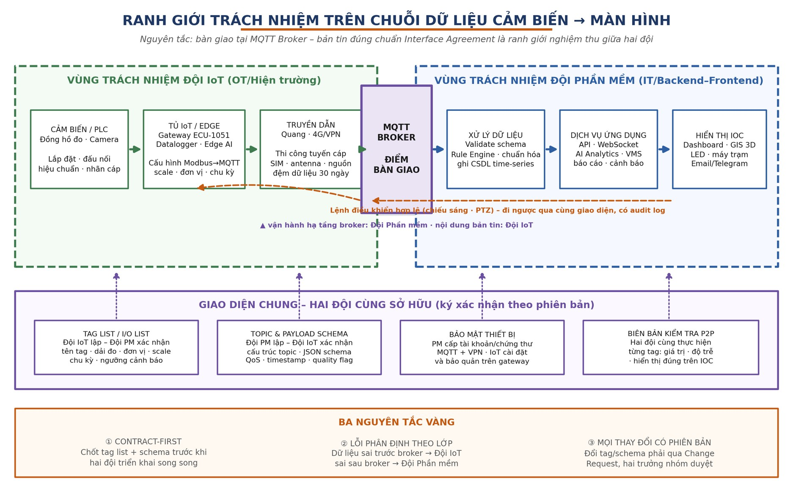
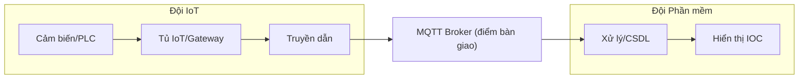
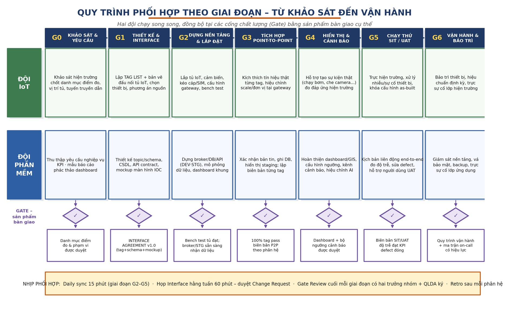
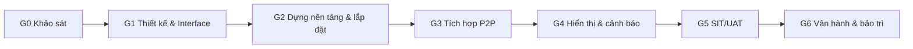
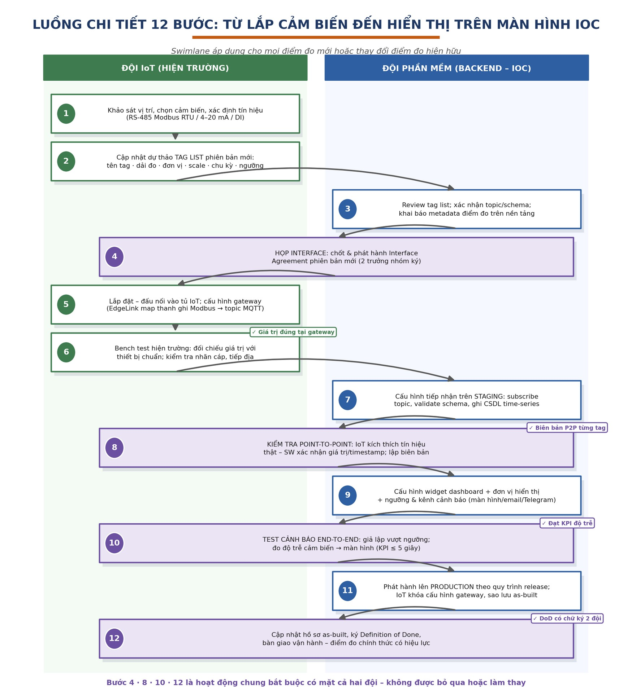

<!-- Page 1 -->

*Quy chế phối hợp liên nhóm – Đội IoT ⇄ Đội Phần mềm · Hệ thống IOC KCN Đồng Văn III*

**TÀI LIỆU QUẢN LÝ DỰ ÁN – LƯU HÀNH NỘI BỘ**

**Hệ thống quản lý vận hành thông minh (IOC) – KCN Đồng Văn III**

# QUY CHẾ PHỐI HỢP LIÊN NHÓM

**ĐỘI IoT (HIỆN TRƯỜNG) ⇄ ĐỘI PHẦN MỀM (BACKEND – IOC)**

Từ xây dựng điểm đo – đọc dữ liệu cảm biến đến hiển thị trên màn hình giám sát

Phân định trách nhiệm hai nhóm – Giao diện chung – Quy trình theo giai đoạn – RACI – KPI phối hợp

*Áp dụng cùng Báo cáo kỹ thuật thi công lắp đặt hệ thống và bộ tiêu chí nghiệm thu phần mềm của dự án*

**Phiên bản 1.1 · Tháng 07/2026**

<!-- Page 2 -->

## MỤC LỤC

1. GIỚI THIỆU
   - 1.1. Mục đích
   - 1.2. Phạm vi và đối tượng áp dụng
   - 1.3. Ba nguyên tắc phối hợp bắt buộc
   - 1.4. Thuật ngữ và định nghĩa
2. TRÁCH NHIỆM TỔNG THỂ CỦA HAI NHÓM
   - 2.1. Đội IoT – chủ trì toàn bộ lớp hiện trường đến điểm bàn giao
   - 2.2. Đội Phần mềm – chủ trì từ điểm bàn giao đến màn hình giám sát
   - 2.3. Điều phối chung
3. RANH GIỚI TRÁCH NHIỆM VÀ ĐIỂM BÀN GIAO
   - 3.1. Bảng phân định theo lớp
   - 3.2. Definition of Done của một điểm đo
4. GIAO DIỆN CHUNG GIỮA HAI NHÓM (INTERFACE AGREEMENT)
   - 4.1. Quy ước định danh điểm đo
   - 4.2. Cam kết về kênh truyền và bản tin dữ liệu
   - 4.3. Tag list – tài liệu giao diện trung tâm
   - 4.4. Giao diện sự kiện, video và điều khiển
   - 4.5. Môi trường và quyền truy cập
5. QUY TRÌNH PHỐI HỢP THEO GIAI ĐOẠN (G0–G6)
6. LUỒNG CHI TIẾT: TỪ CẢM BIẾN ĐẾN MÀN HÌNH (12 BƯỚC)
   - 6.1. Thời lượng tham chiếu và điều kiện hoàn thành
   - 6.2. Quy tắc phối hợp trong luồng
7. NGHI THỨC LÀM VIỆC, CÔNG CỤ VÀ QUẢN LÝ THAY ĐỔI
   - 7.1. Nhịp họp phối hợp
   - 7.2. Kênh liên lạc và công cụ chung
   - 7.3. Quản lý thay đổi (Change Request)
8. PHỐI HỢP XỬ LÝ SỰ CỐ LIÊN NHÓM
   - 8.1. Bảng định vị nhanh (triage)
   - 8.2. Mức độ và SLA phối hợp
9. MA TRẬN TRÁCH NHIỆM RACI
10. KPI PHỐI HỢP VÀ CHẤT LƯỢNG
11. RỦI RO PHỐI HỢP THƯỜNG GẶP VÀ BIỆN PHÁP

PHỤ LỤC A. BIỂU MẪU SỬ DỤNG CHUNG
   - A.1. Mẫu biên bản kiểm tra point-to-point (mỗi lô tag)
   - A.2. Mẫu phiếu Change Request
   - A.3. Checklist Definition of Done (in kèm mỗi lô bàn giao)
   - A.4. Cấu trúc thư mục hồ sơ dùng chung (tham chiếu)

<!-- Page 3 -->

## 1. GIỚI THIỆU

### 1.1. Mục đích

Tài liệu này quy định cách thức phối hợp giữa hai nhóm chuyên môn chính của dự án – Đội IoT (phụ trách thiết bị hiện trường, tủ IoT, truyền dẫn) và Đội Phần mềm (phụ trách backend, nền tảng IOC, hiển thị) – nhằm bảo đảm chuỗi công việc từ lúc xây dựng điểm đo, đọc dữ liệu cảm biến cho đến khi dữ liệu hiển thị chính xác trên màn hình giám sát được thực hiện trôi chảy, có trách nhiệm rõ ràng, có hồ sơ kiểm chứng và không phát sinh vùng xám trách nhiệm. Tài liệu quy định ở cấp độ hai nhóm; việc phân công nội bộ trong từng nhóm do trưởng nhóm tự quyết định và không thuộc phạm vi quy chế này.

### 1.2. Phạm vi và đối tượng áp dụng

- Áp dụng cho toàn bộ vòng đời hệ thống: khảo sát, thiết kế, lắp đặt, tích hợp, chạy thử, nghiệm thu và vận hành – bảo trì.
- Áp dụng cho mọi điểm đo/tín hiệu (telemetry), luồng video – AI, và lệnh điều khiển ngược thuộc bốn phân hệ: môi trường, an ninh – PCCC, năng lượng – nước, trung tâm điều hành.
- Đối tượng: toàn bộ thành viên hai đội, quản lý dự án (QLDA), QA và nhân sự vận hành tiếp nhận hệ thống.
- Tài liệu tham chiếu: Báo cáo kỹ thuật thi công lắp đặt (kiến trúc 5 lớp, danh mục thiết bị, luồng dữ liệu) và bộ tiêu chí nghiệm thu phần mềm của dự án.

### 1.3. Ba nguyên tắc phối hợp bắt buộc

- **Contract-first:** hai đội chỉ triển khai song song sau khi đã ký Interface Agreement (tag list + chuẩn bản tin + mockup màn hình). Hợp đồng giao diện là căn cứ duy nhất khi tranh luận kỹ thuật.
- **Ranh giới nghiệm thu tại MQTT Broker:** Đội IoT chịu trách nhiệm đến khi bản tin đúng chuẩn xuất hiện trên broker; Đội Phần mềm chịu trách nhiệm từ broker đến màn hình. Lỗi phát sinh được phân định theo lớp – trước broker thuộc Đội IoT, sau broker thuộc Đội Phần mềm.
- **Mọi thay đổi có phiên bản:** thay đổi tag, chuẩn bản tin, ngưỡng cảnh báo, cấu hình gateway đều phải qua Change Request, được hai trưởng nhóm duyệt và cập nhật tài liệu trước khi thực thi.

### 1.4. Thuật ngữ và định nghĩa

| Thuật ngữ | Định nghĩa |
|---|---|
| Tag / điểm đo | Một tín hiệu dữ liệu có định danh duy nhất (ví dụ trạng thái bơm, giá trị pH, lưu lượng nước) đi từ hiện trường lên nền tảng |
| Tag list (I/O list) | Bảng danh mục toàn bộ tag: tên, mô tả, nguồn tín hiệu, dải đo, đơn vị, hệ số scale, chu kỳ gửi, ngưỡng cảnh báo – có phiên bản và chữ ký hai đội |
| Interface Agreement | Bộ hồ sơ giao diện được hai đội ký theo phiên bản, gồm: tag list + quy ước kênh truyền/chuẩn bản tin + quy ước chất lượng dữ liệu + mockup hiển thị |
| Kiểm tra P2P (point-to-point) | Kiểm tra từng tag theo chuỗi thật: kích thích tín hiệu tại hiện trường → xác nhận giá trị, thời gian trên nền tảng và màn hình; lập biên bản |
| DoD (Definition of Done) | Bộ tiêu chí hoàn thành của một điểm đo – chỉ khi đạt đủ và có xác nhận hai đội thì điểm đo mới được tính là hoàn thành |
| CR (Change Request) | Phiếu yêu cầu thay đổi giao diện/cấu hình, kèm đánh giá tác động của cả hai đội |
| Gate | Cổng chất lượng cuối mỗi giai đoạn; chỉ vượt gate khi đủ sản phẩm bàn giao quy định |
| SIT / UAT | Chạy thử tích hợp toàn hệ thống / nghiệm thu của người dùng cuối trước khi đưa vào vận hành |
| DEV · STG · PROD | Ba môi trường nền tảng: phát triển, chạy thử (staging) và vận hành chính thức |

<!-- Page 4 -->

<!-- Page 5 -->

## 2. TRÁCH NHIỆM TỔNG THỂ CỦA HAI NHÓM

Dự án tổ chức hai nhóm chuyên môn hoạt động song song. Mỗi nhóm có một Trưởng nhóm là đầu mối duy nhất: cam kết tiến độ – chất lượng phần việc của nhóm mình, ký các hồ sơ giao diện (Interface Agreement, biên bản P2P, DoD) và là người phát ngôn của nhóm trong mọi cuộc họp phối hợp. Cách phân công nội bộ trong nhóm do trưởng nhóm chủ động, miễn bảo đảm mỗi sản phẩm bàn giao chéo có người phụ trách đích danh.

### 2.1. Đội IoT – chủ trì toàn bộ lớp hiện trường đến điểm bàn giao

**Sứ mệnh:** bảo đảm mọi tín hiệu hiện trường được thu thập đúng, đủ, ổn định và xuất hiện trên MQTT Broker dưới dạng bản tin đúng chuẩn Interface Agreement.

- **Khảo sát hiện trường và tín hiệu:** đánh giá PLC/cảm biến hiện hữu, xác định thanh ghi – kiểu tín hiệu – dải đo, bảo đảm nguyên tắc chỉ đọc (read-only) với hệ OT đang vận hành.
- Lập và duy trì **tag list (I/O list)** – nguồn sự thật duy nhất về điểm đo; cập nhật phiên bản as-built sau mỗi thay đổi.
- **Thiết kế – lắp đặt hiện trường:** tủ IoT, cảm biến, đồng hồ đo, camera, trụ, nguồn, tiếp địa, nhãn cáp theo bản vẽ thi công.
- **Thi công và đo kiểm truyền dẫn:** tuyến quang, SIM/antenna 4G; phối hợp Đội Phần mềm thiết lập kênh VPN.
- **Cấu hình gateway/edge:** chu kỳ đọc, quy đổi scale – đơn vị (một lần duy nhất tại gateway), đóng gói bản tin, đệm – truyền bù khi mất kết nối, cài đặt tài khoản/chứng thư bảo mật do Đội Phần mềm cấp.
- **Bench test** tại hiện trường và cùng Đội Phần mềm thực hiện kiểm tra P2P bằng tín hiệu thật.
- **Vận hành – bảo trì lớp hiện trường:** hiệu chuẩn định kỳ, xử lý sự cố thiết bị/kênh truyền, trực on-call phần hiện trường.

### 2.2. Đội Phần mềm – chủ trì từ điểm bàn giao đến màn hình giám sát

**Sứ mệnh:** tiếp nhận trọn vẹn dữ liệu từ broker, xử lý – lưu trữ – phân tích và thể hiện chính xác, kịp thời trên các màn hình giám sát cùng hệ thống cảnh báo.

- **Chủ trì thiết kế giao diện dữ liệu chung:** quy ước kênh truyền, chuẩn bản tin, quy ước chất lượng dữ liệu (trên cơ sở tag list của Đội IoT) và mockup màn hình.
- **Vận hành hạ tầng nền tảng:** MQTT Broker, máy chủ, ba môi trường DEV/STG/PROD, firewall/VPN; cấp và quản lý tài khoản – chứng thư cho thiết bị và người dùng.
- Xây dựng **dịch vụ tiếp nhận** – kiểm tra hợp lệ bản tin, chuẩn hóa và ghi CSDL time-series; quản lý chính sách lưu trữ (≥ 12 tháng).
- Xây dựng **Rule Engine** ngưỡng cảnh báo, vòng đời sự kiện, kênh thông báo (màn hình, email, Telegram) và báo cáo tự động.
- Xây dựng **dashboard IOC, GIS 3D/Digital Twin, phân quyền RBAC, audit log;** bảo đảm hiển thị đúng đơn vị – nhãn – vị trí.
- **Tích hợp và hiệu chỉnh AI** (camera an ninh, khói/lửa), quản lý luồng video trên VMS/NVR ở lớp ứng dụng.
- **Quản lý phát hành** (release DEV→STG→PROD), vá bảo mật, giám sát – backup nền tảng; trực on-call phần nền tảng – ứng dụng.

### 2.3. Điều phối chung

- **Quản lý dự án (QLDA):** chủ trì gate review, phân xử khi hai đội không thống nhất trong 24 giờ, quản lý tiến độ tổng và rủi ro liên nhóm.

<!-- Page 6 -->

- **QA:** độc lập với hai đội; giám sát tuân thủ quy trình P2P, DoD, CR; xác nhận kết quả kiểm thử trước gate.
- **Đại diện vận hành:** tham gia UAT, tiếp nhận đào tạo và hồ sơ as-built khi bàn giao.

<!-- Page 7 -->

## 3. RANH GIỚI TRÁCH NHIỆM VÀ ĐIỂM BÀN GIAO

Chuỗi dữ liệu từ cảm biến đến màn hình được chia thành các lớp; mỗi lớp có đúng một đội sở hữu. Điểm bàn giao nghiệm thu giữa hai đội là MQTT Broker: Đội IoT hoàn thành nghĩa vụ khi bản tin đúng chuẩn Interface Agreement xuất hiện trên broker với giá trị đúng thực tế hiện trường; từ đó trở đi thuộc trách nhiệm Đội Phần mềm.



*Hình 3.1 – Ranh giới trách nhiệm trên chuỗi dữ liệu và các giao diện chung hai đội cùng sở hữu*



### 3.1. Bảng phân định theo lớp

| Lớp / thành phần | Đội sở hữu – phạm vi trách nhiệm | Bằng chứng hoàn thành |
|---|---|---|
| Cảm biến, PLC, đồng hồ đo, camera (thiết bị hiện trường) | Đội IoT: chọn thiết bị đúng thông số, lắp đặt, đấu nối, hiệu chuẩn, nhãn cáp, tiếp địa; tuân thủ read-only với PLC hiện hữu | Biên bản lắp đặt + hiệu chuẩn; ảnh hiện trường; bảng map thanh ghi |
| Tủ IoT / gateway / edge | Đội IoT: cấu hình đọc Modbus, scale – đơn vị, chu kỳ, đóng gói bản tin đúng chuẩn, đệm dữ liệu, cài chứng thư do Đội Phần mềm cấp | Cấu hình gateway trên repo (có version); kết quả bench test |
| Truyền dẫn quang / 4G–VPN | Đội IoT thi công – đo kiểm vật lý; Đội Phần mềm cấp và quản trị VPN/firewall; hai bên phối hợp khi mất kênh truyền | Biên bản đo kiểm tuyến; log kết nối VPN |
| MQTT Broker (điểm bàn giao) | Đội Phần mềm vận hành hạ tầng broker (uptime, tài khoản, mã hóa); Đội IoT chịu trách nhiệm nội dung bản tin đến broker | Bản tin mẫu được QA xác nhận đúng chuẩn + đúng giá trị hiện trường |
| Tiếp nhận – xử lý – lưu trữ (Rule Engine, CSDL) | Đội Phần mềm: kiểm tra hợp lệ, chuẩn hóa, ghi CSDL, đánh giá ngưỡng, độ trễ xử lý | Dữ liệu tra cứu được trên STG/PROD; log xử lý |
| Ứng dụng – hiển thị – cảnh báo (dashboard, GIS, LED, email/Telegram) | Đội Phần mềm: đúng đơn vị – nhãn – vị trí GIS; cảnh báo đúng kênh, đúng mức ưu tiên | Màn hình nghiệm thu theo mockup; kịch bản cảnh báo pass |
| Lệnh điều khiển ngược (9 lộ chiếu sáng, PTZ) | Đội Phần mềm phát lệnh theo phân quyền + audit log; Đội IoT bảo đảm gateway/PLC thực thi và phản hồi trạng thái | Kịch bản điều khiển pass hai chiều, có log |

<!-- Page 8 -->

### 3.2. Definition of Done của một điểm đo

Một điểm đo chỉ được tính hoàn thành khi đạt đủ 8 tiêu chí sau và có xác nhận của hai trưởng nhóm:

| # | Tiêu chí |
|---|---|
| 1 | Thiết bị lắp đặt đúng bản vẽ, có nhãn cáp – nhãn tag vật lý, tiếp địa đạt; hiệu chuẩn/đối chiếu thiết bị chuẩn (nếu là tín hiệu analog) |
| 2 | Giá trị đọc đúng tại gateway (bench test hiện trường có số liệu đối chiếu) |
| 3 | Bản tin lên broker đúng chuẩn Interface Agreement (đúng kênh, đủ trường bắt buộc, thời gian đồng bộ NTP) |
| 4 | Dữ liệu ghi vào CSDL time-series, tra cứu được lịch sử |
| 5 | Hiển thị đúng trên dashboard IOC: đơn vị, số thập phân, nhãn tiếng Việt, vị trí GIS |
| 6 | Ngưỡng cảnh báo cấu hình đúng tag list; test kích hoạt cảnh báo end-to-end đạt (đo độ trễ) |
| 7 | Tag list phiên bản as-built được cập nhật; cấu hình gateway đã lưu kho có phiên bản |
| 8 | Biên bản P2P có chữ ký hai đội; QA xác nhận |

<!-- Page 9 -->

## 4. GIAO DIỆN CHUNG GIỮA HAI NHÓM (INTERFACE AGREEMENT)

Chương này quy định các cam kết giao diện mà hai nhóm phải thống nhất và cùng tuân thủ. Quy chế chỉ nêu yêu cầu ở cấp độ nhóm; đặc tả kỹ thuật chi tiết (định dạng bản tin mẫu, danh mục kênh, bảng schema) do hai đội soạn và ban hành trong bộ hồ sơ Interface Agreement riêng, có phiên bản và chữ ký hai trưởng nhóm.

### 4.1. Quy ước định danh điểm đo

- Mỗi điểm đo có một tên tag duy nhất toàn hệ thống, đặt theo quy ước thống nhất: mã phân hệ – mã thiết bị – loại tín hiệu (chữ in hoa, không dấu).
- Tên tag do Đội IoT đặt khi lập tag list, Đội Phần mềm xác nhận trước khi phát hành; tên đã phát hành không đổi – nếu buộc phải đổi thì coi như tạo điểm đo mới kèm Change Request.
- Tên tag dùng xuyên suốt: cấu hình gateway, CSDL, dashboard, cảnh báo, biên bản kiểm tra – bảo đảm truy vết một mạch từ hiện trường đến màn hình.

### 4.2. Cam kết về kênh truyền và bản tin dữ liệu

| Nội dung cam kết | Yêu cầu ở cấp độ hai nhóm |
|---|---|
| Kênh truyền | Dữ liệu telemetry, sự kiện/cảnh báo, trạng thái thiết bị (heartbeat) và lệnh điều khiển đi trên các kênh tách biệt, đặt tên theo quy ước chung do Đội Phần mềm chủ trì ban hành |
| Nội dung bản tin tối thiểu | Mỗi bản tin dữ liệu phải kèm: thời điểm đọc tín hiệu (đồng bộ NTP), mã gateway gửi, số thứ tự để phát hiện mất bản tin, cờ phân biệt dữ liệu thời gian thực với dữ liệu truyền bù, và giá trị từng tag kèm đơn vị + cờ chất lượng (tốt / nghi ngờ / lỗi kênh đo) |
| Quy đổi giá trị | Mọi phép scale – quy đổi đơn vị thực hiện một lần duy nhất tại gateway theo tag list (trách nhiệm Đội IoT); nền tảng chỉ định dạng hiển thị, không quy đổi lại (trách nhiệm Đội Phần mềm) |
| Heartbeat – mất kết nối | Gateway phát nhịp trạng thái định kỳ; nền tảng cảnh báo mất kết nối khi quá 3 chu kỳ không nhận được – phân biệt rõ mất kênh truyền với lỗi xử lý |
| Đệm – truyền bù | Khi mất kết nối, gateway đệm dữ liệu (tới 30 ngày) và truyền bù khi khôi phục, giữ nguyên thời điểm gốc; nền tảng ghi nhận đúng lịch sử và không tính là dữ liệu thời gian thực |
| Kiểm soát bản tin sai chuẩn | Nền tảng từ chối và ghi log bản tin sai chuẩn; log này được hai đội rà trong daily sync; bản tin sai chuẩn trên môi trường vận hành = 0 (chặn từ staging) |
| Bảo mật | Kênh truyền mã hóa; mỗi gateway một tài khoản/chứng thư riêng do Đội Phần mềm cấp, Đội IoT cài đặt – bảo quản; cấm dùng chung; thu hồi ngay khi thay thiết bị |

### 4.3. Tag list – tài liệu giao diện trung tâm

Tag list do Đội IoT lập và giữ vai trò nguồn sự thật duy nhất về điểm đo; Đội Phần mềm xác nhận từng phiên bản trước khi hiệu lực. Tag list tối thiểu gồm các nhóm thông tin sau:

| Nhóm cột | Nội dung |
|---|---|
| Định danh | Tên tag · mô tả tiếng Việt · phân hệ · trạm/tủ · gateway phụ trách |
| Nguồn tín hiệu | Loại (Modbus RTU/TCP, 4–20 mA, DI/DO, API) · địa chỉ thanh ghi/kênh · kiểu dữ liệu · hệ số scale · offset |
| Đơn vị – dải đo | Đơn vị chuẩn hiển thị · dải đo hợp lệ (min/max) · số thập phân |
| Chu kỳ – cơ chế | Chu kỳ đọc · chu kỳ gửi · gửi ngay khi đổi trạng thái (report-by-exception) có/không |
| Cảnh báo | Ngưỡng cao/thấp các mức · độ trễ xác nhận (debounce) · mức ưu tiên · kênh nhận |
| Quản trị | Phiên bản · ngày hiệu lực · đội lập (IoT) · đội xác nhận (Phần mềm) · trạng thái (dự thảo/hiệu lực/as-built) |

<!-- Page 10 -->

### 4.4. Giao diện sự kiện, video và điều khiển

- **Sự kiện cảnh báo từ edge (AI khói/lửa…):** Đội IoT bảo đảm sự kiện đẩy lên kèm ảnh chụp, loại sự kiện, độ tin cậy, vị trí; Đội Phần mềm chuẩn hóa vòng đời sự kiện (phát hiện → xác nhận → đóng) và hiển thị – lưu vết.
- **Video:** Đội IoT bảo đảm camera cấp luồng chuẩn RTSP/ONVIF, chất lượng hình và nguồn PoE; Đội Phần mềm quản lý kết nối VMS/NVR, phân quyền xem và lưu trữ.
- **Điều khiển ngược:** chỉ áp dụng cho danh mục được duyệt (9 lộ chiếu sáng, PTZ camera); Đội Phần mềm phát lệnh theo phân quyền kèm audit log; Đội IoT bảo đảm thực thi tại hiện trường và phản hồi kết quả trong ≤ 5 giây; mở rộng danh mục phải qua Change Request.

### 4.5. Môi trường và quyền truy cập

| Môi trường | Mục đích | Quy tắc |
|---|---|---|
| DEV | Đội Phần mềm phát triển; dữ liệu mô phỏng theo chuẩn bản tin | Không kết nối thiết bị thật |
| STAGING | Tích hợp P2P, test cảnh báo, SIT | Gateway hiện trường trỏ về STG trong giai đoạn tích hợp; hai đội cùng quyền xem log |
| PROD | Vận hành chính thức | Chỉ Đội Phần mềm thao tác theo quy trình release; gateway chuyển về PROD tại bước 11 của luồng 12 bước; mọi thay đổi có kế hoạch và thông báo trước |

<!-- Page 11 -->

## 5. QUY TRÌNH PHỐI HỢP THEO GIAI ĐOẠN (G0–G6)

Hai đội làm việc song song theo bảy giai đoạn, đồng bộ tại các cổng chất lượng (gate). Không đội nào được vượt gate một mình: sản phẩm gate luôn cần xác nhận của cả hai trưởng nhóm và QLDA.



*Hình 5.1 – Quy trình phối hợp theo giai đoạn với sản phẩm bàn giao tại từng gate*



| Giai đoạn | Đội IoT | Đội Phần mềm | Sản phẩm gate |
|---|---|---|---|
| G0 – Khảo sát & yêu cầu | Khảo sát hiện trường: PLC, cảm biến hiện hữu, vị trí tủ, tuyến cáp/sóng 4G; đánh giá an toàn đấu nối | Thu thập yêu cầu nghiệp vụ giám sát, KPI, mẫu báo cáo; phác thảo dashboard | Danh mục điểm đo + phạm vi được duyệt |
| G1 – Thiết kế & Interface | Lập tag list; bản vẽ đấu nối tủ IoT; chọn thiết bị; phương án nguồn/tiếp địa | Soạn quy ước kênh truyền – chuẩn bản tin, thiết kế CSDL, mockup màn hình IOC; kế hoạch môi trường DEV/STG/PROD | Interface Agreement v1.0 (hai trưởng nhóm ký) |
| G2 – Dựng nền tảng & lắp đặt | Lắp tủ, cảm biến, kéo cáp, SIM/antenna; cấu hình gateway; bench test từng tủ | Dựng broker/CSDL/dịch vụ trên DEV–STG; mô phỏng dữ liệu theo chuẩn; dashboard khung; cấp tài khoản/chứng thư thiết bị | Bench test đạt; STG sẵn sàng nhận dữ liệu thật |
| G3 – Tích hợp P2P | Kích thích tín hiệu thật từng tag; hiệu chỉnh scale/đơn vị tại gateway; xử lý nhiễu | Xác nhận bản tin – ghi CSDL – hiển thị staging; lập biên bản từng tag; log bản tin sai chuẩn | 100% tag pass biên bản P2P theo phân hệ |
| G4 – Hiển thị & cảnh báo | Hỗ trợ tạo sự kiện thật (chạy/dừng bơm, che camera, xả mẫu chuẩn…); đo đáp ứng hiện trường | Hoàn thiện dashboard/GIS; cấu hình ngưỡng + kênh cảnh báo; hiệu chỉnh model AI, giảm cảnh báo nhầm | Dashboard + bộ ngưỡng cảnh báo được duyệt |
| G5 – SIT/UAT | Trực hiện trường trong kịch bản liên động; khóa cấu hình as-built; khắc phục defect lớp thiết bị | Chạy kịch bản end-to-end; đo độ trễ; sửa defect; hỗ trợ người dùng UAT; chuẩn bị release PROD | Biên bản SIT/UAT; KPI độ trễ đạt; defect nghiêm trọng = 0 |
| G6 – Vận hành & bảo trì | Bảo trì – hiệu chuẩn định kỳ thiết bị; trực sự cố lớp hiện trường theo on-call | Giám sát nền tảng, vá bảo mật, backup; trực sự cố lớp ứng dụng theo on-call | Quy trình vận hành + ma trận on-call có hiệu lực |

<!-- Page 12 -->

**Quy tắc song song hóa:** từ G2, Đội Phần mềm không chờ hiện trường – phát triển trên dữ liệu mô phỏng sinh đúng chuẩn bản tin; Đội IoT không chờ nền tảng – bench test bằng broker cục bộ. Hai luồng gặp nhau tại G3 với rủi ro tích hợp đã giảm tối đa nhờ Interface Agreement.

<!-- Page 13 -->

## 6. LUỒNG CHI TIẾT: TỪ CẢM BIẾN ĐẾN MÀN HÌNH (12 BƯỚC)

Mọi điểm đo mới (hoặc thay đổi điểm đo hiện hữu) đều đi qua đúng 12 bước dưới đây. Các bước 4, 8, 10, 12 là hoạt động chung bắt buộc có mặt cả hai đội. Với các phân hệ lớn, hai đội gom nhiều tag thành từng lô (batch) nhưng biên bản P2P vẫn ghi nhận theo từng tag.



*Hình 6.1 – Swimlane 12 bước triển khai một điểm đo, với các mốc kiểm chứng bắt buộc*

### 6.1. Thời lượng tham chiếu và điều kiện hoàn thành

| Bước | Điều kiện hoàn thành (exit criteria) | Thời lượng tham chiếu |
|---|---|---|
| 1–2 | Tag list dự thảo đủ cột bắt buộc (mục 4.3), có dải đo và scale do Đội IoT xác nhận | 0,5–1 ngày/lô tag |
| 3–4 | Interface Agreement phiên bản mới phát hành; điểm đo khai báo trên STG | ≤ 2 ngày kể từ nhận dự thảo |
| 5–6 | Gateway đọc giá trị đúng (sai số trong dung sai thiết bị); ảnh + số liệu bench test lưu hồ sơ | 1–3 ngày/tủ tùy số tag |
| 7–8 | 100% tag của lô pass P2P trên STG: đúng giá trị, đúng thời điểm, đúng cờ chất lượng; biên bản ký | 0,5–1 ngày/lô |
| 9–10 | Widget + ngưỡng cấu hình đúng tag list; cảnh báo end-to-end đạt KPI độ trễ (telemetry ≤ 5 giây, sự kiện ≤ 2 giây) | 0,5–1 ngày/lô |
| 11–12 | Release PROD theo checklist phát hành; cấu hình gateway khóa + sao lưu; DoD ký; hồ sơ as-built cập nhật trong 3 ngày | 0,5 ngày/lô |

<!-- Page 14 -->

### 6.2. Quy tắc phối hợp trong luồng

- Kiểm tra P2P (bước 8) luôn dùng tín hiệu thật ở hiện trường (chạy bơm thật, nhúng cảm biến vào dung dịch chuẩn, che khói thử camera…) – nghiêm cấm chỉ giả lập giá trị trên gateway để pass biên bản.
- Khi một tag fail: định vị theo lớp (mục 3.1) rồi giao đúng đội xử lý; tag fail không chặn các tag khác trong lô nhưng phải đóng trước gate của phân hệ.
- Trong thời gian tích hợp G3–G5, mọi thay đổi cấu hình gateway hoặc chuẩn bản tin phải thông báo trên kênh chung trước khi thực hiện tối thiểu 4 giờ (trừ sửa sự cố khẩn).
- Điểm đo dùng đường 4G: kiểm tra thêm kịch bản mất sóng – truyền bù (rút antenna 10 phút, xác nhận dữ liệu đệm về đủ và đúng thời điểm gốc).

<!-- Page 15 -->

## 7. NGHI THỨC LÀM VIỆC, CÔNG CỤ VÀ QUẢN LÝ THAY ĐỔI

### 7.1. Nhịp họp phối hợp

| Cuộc họp | Tần suất | Thành phần | Nội dung – đầu ra |
|---|---|---|---|
| Daily sync | 15 phút/ngày (G2–G5) | Hai đội (đầu mối + người liên quan) | Tiến độ lô tag trong ngày; vướng mắc chéo; log bản tin lỗi – đầu ra: danh sách hành động trong ngày |
| Họp Interface hằng tuần | 60 phút/tuần | Hai trưởng nhóm, QA, QLDA | Duyệt Change Request; rà phiên bản tài liệu; thống nhất kế hoạch tuần – đầu ra: biên bản + CR được duyệt/từ chối |
| Gate review | Cuối mỗi giai đoạn | Hai trưởng nhóm, QA, QLDA, đại diện vận hành (từ G4) | Rà sản phẩm gate theo checklist – đầu ra: quyết định vượt gate có chữ ký |
| Retro phân hệ | Sau mỗi phân hệ hoàn thành | Hai đội | Bài học phối hợp, cập nhật quy chế nếu cần |

### 7.2. Kênh liên lạc và công cụ chung

- **Kênh trao đổi tức thời:** một nhóm chat chung duy nhất cho vấn đề tích hợp (kèm quy ước tag tin nhắn [P2P], [CR], [SỰ CỐ]); cấm trao đổi quyết định kỹ thuật qua kênh riêng tư.
- **Kho cấu hình (repo):** cấu hình gateway, quy ước bản tin, script mô phỏng dữ liệu được lưu theo phiên bản; nhánh riêng cho STG/PROD.
- **Trình theo dõi công việc (issue tracker):** mỗi tag fail, defect, CR là một ticket có đội phụ trách và hạn xử lý; bảng kanban chung hai đội.
- **Thư mục tài liệu dùng chung:** tag list, Interface Agreement, biên bản P2P, DoD, hồ sơ as-built – cấu trúc thư mục và quyền truy cập thống nhất, chỉ bản có hiệu lực nằm ở thư mục gốc.

### 7.3. Quản lý thay đổi (Change Request)

**Đối tượng bắt buộc qua CR:** tag list, quy ước kênh truyền/chuẩn bản tin, ngưỡng cảnh báo, danh mục đối tượng điều khiển, cấu hình gateway trên PROD, và mockup màn hình đã duyệt.

| Bước CR | Nội dung |
|---|---|
| 1. Lập phiếu | Đội đề xuất mô tả thay đổi, lý do, phạm vi tag/màn hình ảnh hưởng |
| 2. Đánh giá tác động | Cả hai đội đánh giá trong ≤ 2 ngày làm việc: khối lượng, rủi ro, ảnh hưởng dữ liệu lịch sử |
| 3. Duyệt | Họp Interface hằng tuần duyệt (thay đổi lớn cần thêm QLDA); CR khẩn có thể duyệt online nhưng phải bổ sung biên bản |
| 4. Thực thi | Cập nhật tài liệu (tăng phiên bản) TRƯỚC, thực thi SAU; thực hiện trên STG, pass P2P lại các tag ảnh hưởng rồi mới lên PROD |
| 5. Đóng | QA xác nhận; thông báo toàn dự án; lưu vết trong nhật ký thay đổi |

- **Quy tắc đóng băng (freeze):** 48 giờ trước SIT/UAT và trước mọi đợt nghiệm thu – không thực thi CR trừ sửa lỗi chặn (blocker) có xác nhận QLDA.

<!-- Page 16 -->

- **Phân loại:** thay đổi nhỏ (thêm tag cùng mẫu, đổi ngưỡng) – duyệt trong tuần; thay đổi lớn (đổi chuẩn bản tin, thêm phân hệ, đổi kiến trúc kênh truyền) – cần kế hoạch riêng và gate phụ.

<!-- Page 17 -->

## 8. PHỐI HỢP XỬ LÝ SỰ CỐ LIÊN NHÓM

### 8.1. Bảng định vị nhanh (triage)

Khi có sự cố dữ liệu/hiển thị, người trực dùng bảng dưới đây để định vị lớp lỗi và giao đúng đội chủ trì trong vòng 15 phút, tránh tình trạng đổ lỗi vòng quanh:

| Hiện tượng | Chẩn đoán nhanh | Đội chủ trì | Hướng xử lý – đội phối hợp |
|---|---|---|---|
| Một tag không cập nhật, các tag khác cùng gateway bình thường | Lỗi kênh đo đơn lẻ (cảm biến, dây tín hiệu, thanh ghi) | Đội IoT | Kiểm tra cảm biến/RS-485/nguồn kênh đo; Đội Phần mềm hỗ trợ tra log bản tin gần nhất |
| Toàn bộ tag của một gateway mất; heartbeat mất | Mất nguồn/kênh truyền/hỏng gateway | Đội IoT | Kiểm tra nguồn, SIM/antenna, tuyến quang; Đội Phần mềm xác nhận trạng thái VPN – broker; dữ liệu sẽ truyền bù khi khôi phục |
| Bản tin có trên broker nhưng không vào CSDL/không hiển thị | Lỗi dịch vụ tiếp nhận/kiểm tra hợp lệ/CSDL | Đội Phần mềm | Xem log tiếp nhận – hàng đợi; Đội IoT không can thiệp cấu hình trong lúc này |
| Bản tin bị từ chối do sai chuẩn sau một thay đổi | Cấu hình gateway lệch phiên bản Interface | Đội IoT | Đối chiếu phiên bản Interface Agreement; nếu do CR chưa đồng bộ → lỗi quy trình, ghi nhận trong retro |
| Giá trị hiển thị sai đơn vị/scale so với hiện trường | Scale hai lần hoặc sai hệ số | Hai đội cùng | Đối chiếu tag list: Đội IoT xác nhận giá trị tại gateway, Đội Phần mềm xác nhận không quy đổi lại; sửa tại đúng một nơi theo mục 4.2 |
| Cảnh báo chậm > KPI hoặc không phát | Rule engine/kênh gửi hoặc debounce sai | Đội Phần mềm | Kiểm tra rule – hàng đợi – kênh email/Telegram; Đội IoT xác nhận thời điểm tín hiệu gốc |
| Cảnh báo nhầm lặp lại (đặc biệt AI camera) | Ngưỡng/độ tin cậy model chưa phù hợp điều kiện hiện trường | Đội Phần mềm | Hiệu chỉnh ngưỡng/model; Đội IoT hỗ trợ điều chỉnh góc camera, vệ sinh ống kính, chiếu sáng |
| Video mất hình nhưng telemetry bình thường | PoE/camera/luồng RTSP | Đội IoT | Kiểm tra PoE – camera – cáp; Đội Phần mềm kiểm tra kết nối VMS/NVR song song |

### 8.2. Mức độ và SLA phối hợp

| Mức | Định nghĩa | Thời gian tiếp nhận | Mục tiêu khắc phục |
|---|---|---|---|
| P1 | Mất giám sát diện rộng (≥ 1 phân hệ) hoặc mất cảnh báo an toàn (PCCC, khói/lửa) | 15 phút, 24/7 | ≤ 4 giờ; cập nhật tiến triển mỗi giờ |
| P2 | Mất một cụm thiết bị/gateway; cảnh báo trễ vượt KPI | 30 phút giờ hành chính, 60 phút ngoài giờ | ≤ 8 giờ làm việc |
| P3 | Một tag lỗi, hiển thị sai không ảnh hưởng an toàn | 4 giờ làm việc | ≤ 3 ngày làm việc |
| P4 | Góp ý cải tiến, sai chính tả nhãn hiển thị | Ghi nhận backlog | Theo kế hoạch tuần |

<!-- Page 18 -->

- **On-call:** mỗi đội duy trì một người trực chính + một dự phòng theo lịch tuần; danh bạ trực dán tại phòng IOC và lưu trên kênh chung.
- **Leo thang:** quá 50% thời gian mục tiêu chưa định vị được lớp lỗi → hai trưởng nhóm cùng vào cuộc; quá thời gian mục tiêu → báo QLDA. Sự cố P1/P2 phải có báo cáo nguyên nhân gốc (RCA) trong 3 ngày, nêu rõ hành động phòng ngừa của từng đội.
- **Nguyên tắc ứng xử:** ưu tiên khôi phục dịch vụ trước, phân định trách nhiệm sau; mọi thao tác khắc phục đều ghi log/nhật ký ca trực.

<!-- Page 19 -->

## 9. MA TRẬN TRÁCH NHIỆM RACI

R – Responsible (thực hiện) · A – Accountable (chịu trách nhiệm cuối, duy nhất một A mỗi dòng) · C – Consulted (tham vấn) · I – Informed (được thông báo).

| Hạng mục công việc | Đội IoT | Đội Phần mềm | QLDA | QA/Vận hành |
|---|---|---|---|---|
| **Thiết kế – giao diện** | | | | |
| Khảo sát hiện trường, danh mục điểm đo | A/R | C | I | I |
| Yêu cầu nghiệp vụ, KPI giám sát, mockup dashboard | C | A/R | C | C |
| Tag list / I-O list | A/R | C (xác nhận) | I | I |
| Quy ước kênh truyền, chuẩn bản tin, giao diện dịch vụ | C (xác nhận) | A/R | I | I |
| Interface Agreement (phát hành phiên bản) | R | R | A | C |
| **Triển khai** | | | | |
| Lắp đặt thiết bị, tủ IoT, tuyến truyền dẫn | A/R | I | I | C |
| Cấu hình gateway (Modbus→MQTT, scale, đệm) | A/R | C | I | I |
| Broker, dịch vụ tiếp nhận, CSDL, Rule Engine | I | A/R | I | I |
| Dashboard, GIS 3D, phân quyền RBAC | I | A/R | I | C |
| Model AI camera và hiệu chỉnh | C (hiện trường) | A/R | I | I |
| Tài khoản/chứng thư thiết bị, VPN, firewall | R (cài đặt) | A/R (cấp/quản trị) | I | I |
| **Kiểm thử – nghiệm thu** | | | | |
| Bench test tủ IoT tại hiện trường | A/R | I | I | C |
| Kiểm tra P2P từng tag | R | R | I | A (xác nhận) |
| Test cảnh báo end-to-end, đo độ trễ | R | R | I | A |
| SIT – kịch bản liên động | R | R | A | C |
| UAT với người dùng cuối | C | R | A | R |
| Release lên PROD | C | A/R | I | C |
| **Vận hành – duy trì** | | | | |
| Bảo trì, hiệu chuẩn thiết bị hiện trường | A/R | I | I | C |
| Giám sát nền tảng, backup, vá bảo mật | I | A/R | I | I |
| Xử lý sự cố theo triage (mục 8.1) | R (lớp hiện trường) | R (lớp nền tảng) | I | A (điều phối/xác nhận đóng) |
| Change Request và hồ sơ as-built | R | R | A | C |
| Đào tạo – bàn giao vận hành | R | R | A | C |

<!-- Page 20 -->

## 10. KPI PHỐI HỢP VÀ CHẤT LƯỢNG

Các chỉ số dưới đây được QA tổng hợp theo tuần trong giai đoạn triển khai và theo tháng khi vận hành; là căn cứ đánh giá chất lượng phối hợp tại gate review và retro:

| Chỉ số | Mục tiêu | Cách đo |
|---|---|---|
| Tỷ lệ tag pass kiểm tra P2P ngay lần đầu | ≥ 95% | Biên bản P2P theo lô |
| Độ trễ telemetry cảm biến → màn hình IOC | ≤ 5 giây | Đo trong test cảnh báo end-to-end và giám sát định kỳ |
| Độ trễ sự kiện/cảnh báo (kể cả AI) | ≤ 2 giây từ khi nền tảng nhận bản tin | Log rule engine – kênh gửi |
| Tính sẵn sàng thu thập dữ liệu mỗi gateway | ≥ 99,5%/tháng (không tính mất nguồn ngoài phạm vi) | Heartbeat – thống kê nền tảng |
| Bản tin sai chuẩn trên môi trường vận hành | 0 (mọi sai lệch chặn từ STG) | Log tiếp nhận |
| Thời gian xử lý sự cố P1 / P2 | ≤ 4 giờ / ≤ 8 giờ làm việc | Nhật ký sự cố |
| Thay đổi thực hiện đúng quy trình CR | 100% | Đối chiếu nhật ký thay đổi với cấu hình thực tế |
| Cập nhật hồ sơ as-built sau thay đổi | ≤ 3 ngày làm việc | Kiểm tra thư mục tài liệu |
| Cảnh báo nhầm AI camera sau hiệu chỉnh | Giảm dần theo tháng, có báo cáo | Thống kê sự kiện bị người trực đánh dấu sai |
| Sự cố lặp lại cùng nguyên nhân gốc | 0 trong 90 ngày sau RCA | Đối chiếu RCA – nhật ký sự cố |

<!-- Page 21 -->

## 11. RỦI RO PHỐI HỢP THƯỜNG GẶP VÀ BIỆN PHÁP

| Rủi ro | Dấu hiệu | Biện pháp phòng ngừa |
|---|---|---|
| Hai đội hiểu khác nhau về cùng một điểm đo | Tranh cãi khi P2P; giá trị hiển thị sai scale/đơn vị | Tag list là nguồn sự thật duy nhất; mọi trường bắt buộc phải điền; scale chỉ làm một lần tại gateway |
| Đội Phần mềm chờ hiện trường (hoặc ngược lại) | Nhân sự rảnh việc cục bộ, dồn tích hợp về cuối | Song song hóa bằng dữ liệu mô phỏng đúng chuẩn + broker cục bộ; Interface Agreement chốt sớm ở G1 |
| Thay đổi âm thầm không báo | Bản tin bị từ chối; dashboard vỡ; mất thời gian truy vết | Mọi thay đổi qua CR; thông báo trước ≥ 4 giờ trong giai đoạn tích hợp; freeze trước nghiệm thu |
| Pass P2P bằng giá trị giả lập | Nghiệm thu xong nhưng vận hành sai thực tế | Bắt buộc tín hiệu thật khi P2P; QA chứng kiến xác suất; đối chiếu ảnh/số liệu hiện trường |
| Vùng xám khi sự cố (đổ lỗi vòng quanh) | Sự cố kéo dài, không ai chủ trì | Bảng triage mục 8.1 + nguyên tắc phân định theo lớp; khôi phục trước – phân định sau |
| Lệch phiên bản cấu hình giữa gateway và nền tảng | Một số tủ gửi chuẩn cũ sau khi nâng cấp | Cấu hình lưu kho có phiên bản; checklist release yêu cầu xác nhận đồng bộ từng gateway |
| Mất người nắm việc (nghỉ, chuyển) | Không ai hiểu cấu hình một phân hệ | Hồ sơ as-built cập nhật ≤ 3 ngày; mỗi hạng mục có người dự phòng; bàn giao có kiểm tra chéo |
| Kênh 4G không ổn định làm nhiễu đánh giá | Tag chập chờn bị quy nhầm cho phần mềm | Heartbeat + cờ truyền bù phân biệt rõ mất kênh và lỗi xử lý; kịch bản test truyền bù bắt buộc |

<!-- Page 22 -->

## PHỤ LỤC A. BIỂU MẪU SỬ DỤNG CHUNG

### A.1. Mẫu biên bản kiểm tra point-to-point (mỗi lô tag)

| # | Tag | Giá trị hiện trường | Giá trị gateway | Giá trị IOC | Độ trễ (s) | Kết quả |
|---|---|---|---|---|---|---|
| 1 | QT_OUT_PH | 7,21 (máy chuẩn) | 7,21 | 7,21 | 3,2 | Pass |
| 2 | XLNT_PUMP01_RUN | Chạy (quan sát) | 1 | Đang chạy | 1,8 | Pass |
| … | … | … | … | … | … | … |

**Phần ký:** đại diện Đội IoT · đại diện Đội Phần mềm · QA chứng kiến – kèm ngày giờ, phiên bản Interface Agreement áp dụng, môi trường (STG/PROD).

### A.2. Mẫu phiếu Change Request

| Mục | Nội dung |
|---|---|
| Mã CR / ngày lập / đội lập | CR-YYYY-NNN · … · … |
| Nội dung thay đổi | Mô tả rõ: tag/chuẩn bản tin/ngưỡng/màn hình nào, từ giá trị nào sang giá trị nào |
| Lý do | … |
| Đánh giá tác động Đội IoT | Khối lượng, thiết bị/tủ ảnh hưởng, thời gian dừng thu thập (nếu có) |
| Đánh giá tác động Đội Phần mềm | Chuẩn bản tin/CSDL/dashboard/báo cáo ảnh hưởng; xử lý dữ liệu lịch sử |
| Kết luận duyệt | Duyệt / từ chối / hoãn – chữ ký hai trưởng nhóm (+ QLDA nếu thay đổi lớn); phiên bản tài liệu mới |

### A.3. Checklist Definition of Done (in kèm mỗi lô bàn giao)

Sử dụng đúng 8 tiêu chí tại mục 3.2; mỗi tiêu chí đánh dấu Đạt/Không kèm ghi chú; chỉ chuyển trạng thái điểm đo sang "vận hành" khi đủ 8/8.

### A.4. Cấu trúc thư mục hồ sơ dùng chung (tham chiếu)

```text
/00_InterfaceAgreement/   (chi ban co hieu luc + thu muc /archive)
/01_TagList/              TagList_v1.3_ASBUILT.xlsx
/02_BienBan_P2P/          theo phan he / theo lo
/03_ChangeRequest/        CR-2026-001..., nhat ky thay doi
/04_SuCo_RCA/             bao cao nguyen nhan goc P1-P2
/05_AsBuilt/              cau hinh gateway (export), ban ve hoan cong
/06_VanHanh/              lich on-call, nhat ky ca truc, quy trinh
```
