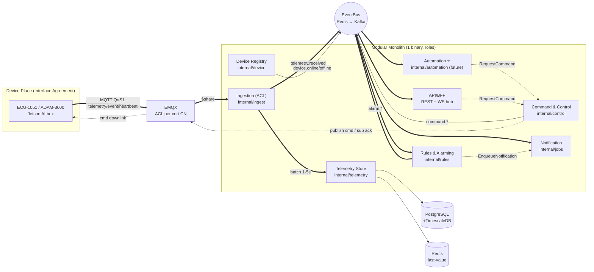

# Brainstorm Report — DDD/EDA Bounded Context Design (Bridge POC → Production)

**Date:** 2026-07-24 09:42 · **Skill:** /brainstorm · **Status:** ⏳ Approved theo option Recommended (user AFK sau 60s — cần user confirm lại)
**Nguồn kế thừa:** `brainstorm-260723-1438-poc-onprem-only-architecture-modular-monolith-vs-microservices-report.md` (PA-1 Modular Monolith đã chốt) · `docs/system-architecture.md` v1.0 (D1–D7 sticky) · `plans/260723-1450-poc-onprem-iiot-modular-monolith/plan.md`

---

## 0. Problem Statement & Scope Decisions

Yêu cầu: thiết kế IIoT Platform theo DDD + EDA — bounded contexts, event catalog, automation engine first-class, evolution monolith → microservices.

**Scope decisions (user confirm 2026-07-24 09:42):**
1. **Design target:** Bridge POC → Production — contexts map lên `internal/` modules hiện có; event catalog cho cả Redis bus (POC) lẫn Kafka (production D2); KHÔNG đảo quyết định sticky nào.
2. **Automation Engine:** design-only — POC giữ nguyên 8 phases, engine implement sau POC.
3. **Artifact:** report này + `docs/ddd-bounded-context-map.md` (nguồn sự thật team) + link từ system-architecture.md.
4. **Ngôn ngữ:** tiếng Việt + term Anh.

**Không thay đổi:** 8 phases POC, sticky D1–D7, Interface Agreement topic `v1/{tenant}/{park}/{subsys}/{node}/telemetry|event|heartbeat|cmd|cmd/ack`, effort 5 dev/4 tuần, KPI (telemetry E2E ≤5s · alarm ≤2s · cmd ack ≤5s · 2.000 msg/s).

---

## 1. Domain Analysis

### Phân loại chiến lược (Strategic Design)

| Loại | Domain | Lý do |
|---|---|---|
| **Core** | Rules & Alarming · Automation & Workflow · Command & Control | Giá trị cạnh tranh = "phát hiện → quyết định → hành động an toàn". Safety-critical invariants sống ở đây. Đầu tư thiết kế sâu nhất |
| **Supporting** | Telemetry (Ingestion + Store/Query) · Device Registry · Camera & Vision · Notification | Cần thiết, pattern chuẩn ngành, không cần sáng tạo |
| **Generic** | Identity & Access · Audit · Analytics/Reporting · Tenancy | Mua/dùng sẵn (Keycloak, Grafana, Temporal) — đúng nguyên tắc managed-first |

### Insight then chốt

1. **Rules ≠ Automation.** Rules = DETECT (stateless eval → alarm, ngôn ngữ: threshold/severity/lifecycle). Automation = ACT (stateful orchestration → command, ngôn ngữ: trigger/condition/action/workflow). Tốc độ thay đổi khác nhau, yêu cầu an toàn khác nhau → 2 bounded contexts.
2. **Ingestion không phải domain** — là Anti-Corruption Layer (ACL) giữa wire format (Interface Agreement) và domain model. Mọi context khác chỉ thấy `TelemetryPoint` đã normalize.
3. **Command & Control = chokepoint an toàn duy nhất.** Mọi actor (user qua API, automation engine) đi qua 1 cửa: whitelist + idempotency + audit + interlock. Không có đường tắt xuống MQTT.
4. **API/BFF không phải bounded context** — composition layer đọc read models + push WS.

---

## 2. Bounded Context Map

Map 1:1 lên layout `internal/` đã chốt (brainstorm 260723 mục 8) — **không rename gì**:

| # | Bounded Context | Module | Aggregate / State machine | Loại |
|---|---|---|---|---|
| 1 | Telemetry Ingestion (ACL) | `internal/ingest` | — stateless pipe: decode, validate IA, normalize, dedup seq, backfill flag | Supporting |
| 2 | Telemetry Store & Query | `internal/telemetry` | TimeSeries (hypertable) + last-value (Redis). CQRS: write từ ingest, read cho API | Supporting |
| 3 | Rules & Alarming | `internal/rules` | **Alarm**: open → acked → closed; dedup/flapping suppression | **Core** |
| 4 | Automation & Workflow ⭐ | `internal/automation` (future) | **AutomationRule** (ECA) · **WorkflowRun** | **Core** |
| 5 | Command & Control | `internal/control` | **Command**: pending → sent → acked/failed/timeout; whitelist catalog | **Core** |
| 6 | Device Registry | `internal/device` | **Device/Gateway**: heartbeat → online/offline | Supporting |
| 7 | Camera & Vision | `internal/camera` | Camera; AI event → normalize vào pipeline chung | Supporting |
| 8 | Notification | `internal/jobs` (notify) | Delivery: dedup, escalation policy, durable qua PG queue | Supporting |
| 9 | Identity & Access | `internal/auth` | User/Role (RBAC 3 role POC) → swap Keycloak/OIDC | Generic |
| 10 | Audit | bảng audit (control/auth ghi) → consumer event production | — | Generic |
| 11 | Analytics/Reporting | jobs report stub + Grafana ops | — | Generic |
| 12 | Tenancy | policy layer production (D6: PG RLS + EMQX ACL + cell_id); POC giữ tenant/park trong topic/schema | — | Generic |

### Quan hệ giữa contexts (context map patterns)

- Interface Agreement (wire) —**ACL**→ Ingestion —**Published Language** (`TelemetryPoint`)→ Store, Rules, Automation.
- Rules —PL (`AlarmEvent`)→ Notification, Automation, WS hub, Audit (conformist downstream).
- Automation —**Customer/Supplier**→ Control: automation là customer của Command API (Open Host Service); KHÔNG publish MQTT trực tiếp.
- Device Registry —PL (`device.online/offline`)→ Rules, Automation.
- API/BFF: chỉ query read models + subscribe bus; không gọi xuyên context logic.

---

## 3. Microservice Decomposition

**Nguyên tắc:** deployment unit ≠ module boundary. POC = 1 binary, 2 container (role `ingest+worker`, role `api`). Tách service theo **áp lực thực tế** (scale/fault-isolation), không theo sơ đồ đẹp.

| Thứ tự tách | Context → Service | Áp lực kích hoạt tách |
|---|---|---|
| 1 | Ingestion | msg/s vượt 1 process; stateless, EMQX `$share` group → scale ngang tự nhiên |
| 2 | Rules & Alarming | latency alarm ≤2s bị vi phạm khi eval nặng; partition theo device |
| 3 | Automation & Workflow | Temporal workers (D2) — bản chất đã là service riêng |
| 4 | Command & Control | fault isolation an toàn — lệnh xuống thiết bị không được chết chung process khác |
| 5 | API/BFF | đã là role riêng — tách = đổi cách deploy |
| 6 | Notification | job workers scale theo queue depth |
| Giữ module lâu dài | Device Registry, Camera | ít thay đổi, ít tải; consolidate được |
| Không tự viết | Identity | → Keycloak (D2) |

---

## 4. Event Catalog

### Tầng 1 — Wire events (MQTT, Interface Agreement — external contract, bất biến)

`v1/{tenant}/{park}/{subsys}/{node}/telemetry|event|heartbeat|cmd|cmd/ack` — QoS1, app-level ack, mandatory fields: NTP ts, gateway ID, seq, backfill flag, quality flag.

### Tầng 2 — Domain events (POC: Redis channels → Production: Kafka topics; cùng EventBus interface)

| Event | Producer | Consumers | Durable? | POC channel / Prod topic |
|---|---|---|---|---|
| `telemetry.received` | Ingestion | Rules, Automation, WS hub | Không (DB đã lưu) | `rt:telemetry` / `telemetry.raw` (key=device_id) |
| `device.online` / `device.offline` | Device Registry | Rules, Automation, WS hub | Không | `rt:telemetry`* / `domain.device-state` (compacted) |
| `alarm.raised/acked/cleared` | Rules | Notification, Automation, WS hub, Audit | **Có** (outbox từ Stage 1) | `rt:alarm` / `domain.alarms` |
| `automation.triggered` | Automation | Audit, WS hub | **Có** | — (future) / `domain.automation` |
| `workflow.started/completed/failed` | Automation (L3) | Audit, WS hub | **Có** | — / Temporal history + `domain.automation` |
| `command.requested/sent/acked/failed/timeout` | Control | WS hub, Audit, Automation | **Có** | `rt:command` / `domain.commands` (compacted key=command_id) |
| `notification.sent/failed` | Notification | Audit | Có | PG job log / `domain.notifications` |

\* POC: device state đơn giản đi qua channel telemetry hoặc thêm channel `rt:device` khi Phase 2 cần — quyết ở implement.

### Tầng 3 — Commands (imperative) & Queries (sync)

**Commands — KHÔNG dùng pub/sub** (cần durable + exactly-once-ish):

| Command | Từ → Đến | POC transport | Production transport |
|---|---|---|---|
| `RequestCommand` | API / Automation → Control | in-process call + PG row (idempotency key) | async command topic hoặc gRPC + pending state |
| `EnqueueNotification` | Rules / Automation → Notification | PG River queue | PG/Kafka queue |
| `StartWorkflow` | ECA action → Workflow engine | — (design-only) | Temporal client signal |

**Queries — sync cho phép:** REST đọc read model · last-value từ Redis · history từ TimescaleDB · auth check · whitelist validation tại điểm phát lệnh · stream URL (MediaMTX).

**Quy tắc sync vs async:** mặc định async giữa contexts. Sync chỉ: (a) user-facing reads, (b) validation lúc phát lệnh — trả `pending` ngay, kết quả về qua WS (`CommandState` đã model sẵn trong `events/types.go`).

---

## 5. Service Interaction Diagram



Nét đứt = downlink/điều khiển + imperative commands · nét liền đậm = luồng dữ liệu chính.

---

## 6. Automation Workflow Architecture (design-only POC)

### 3 lớp

```
L1 DETECTION — internal/rules (POC Phase 3, ĐANG LÀM)
   Threshold/window eval trên telemetry stream → AlarmEvent. Stateless, ≤2s.

L2 ECA AUTOMATION — internal/automation (implement SAU POC)
   Trigger:   event pattern — alarm.raised, telemetry.received (metric match),
              device.offline, schedule/cron
   Condition: device state (Redis last-value) · calendar · interlock check ·
              cooldown per (rule, device)
   Action:    RequestCommand (qua Control) · EnqueueNotification ·
              StartWorkflow · webhook
   Single-step, latency-sensitive. Definitions PG (versioned) + execution log.

L3 WORKFLOW — Temporal (production, D2)
   Multi-step durable: escalation chain, maintenance sequence, human-approval,
   compensation/retry. Seam: interface WorkflowEngine; ECA action
   "start_workflow" = cầu L2→L3. POC không implement.
```

### Safety invariants (bắt buộc, không thương lượng)

1. **Một cửa:** automation không publish MQTT trực tiếp — 100% qua Command context (whitelist + idempotency + audit, actor=`automation:{rule_id}`).
2. **Loop protection:** cooldown per (rule, device) · max trigger rate · phát hiện chu trình automation→command→telemetry→chính nó.
3. **Manual override thắng automation** · kill-switch toàn cục 1 flag · dry-run mode cho rule mới.
4. Execution log đầy đủ: trigger event id → condition eval result → action → command id (trace chain).

### Data model phác thảo (PG, cho giai đoạn implement)

- `automation_rules(id, name, enabled, trigger_spec jsonb, condition_spec jsonb, action_spec jsonb, cooldown_sec, version, updated_by)`
- `automation_executions(id, rule_id, trigger_event, condition_result, action_result, command_id, ts)`

---

## 7. Folder / Repository Structure

Giữ nguyên structure user chốt 2026-07-23 — chỉ THÊM 1 package future:

```
apps/backend/
├── cmd/app/                # main, role: api|ingest|worker|all
├── internal/
│   ├── ingest/             # BC: Telemetry Ingestion (ACL)
│   ├── telemetry/          # BC: Telemetry Store & Query (TelemetryStore interface = seam ClickHouse)
│   ├── rules/              # BC: Rules & Alarming
│   ├── automation/         # BC: Automation & Workflow ⭐ SAU POC (WorkflowEngine interface = seam Temporal)
│   ├── control/            # BC: Command & Control
│   ├── device/             # BC: Device Registry
│   ├── camera/             # BC: Camera & Vision
│   ├── jobs/               # BC: Notification + PG River queue infra
│   ├── auth/               # BC: Identity (interface = seam Keycloak)
│   ├── api/                # Composition layer: Gin REST + WS hub
│   ├── events/             # Infra: EventBus (in-process + Redis; interface = seam Kafka) — ĐÃ CÓ
│   └── config/, app/       # Infra — ĐÃ CÓ
├── migrations/  ·  api/openapi.yaml
apps/web/  ·  infra/edge/  ·  deploy/  ·  Makefile
```

**Kỷ luật giữ seam (điều kiện sống còn cho evolution):**
- Module owns its tables — **cấm cross-context SQL JOIN**; truy cập chéo qua Go interface.
- FK giữa contexts trong cùng PG: chấp nhận POC nhưng document FK nào sẽ đứt khi tách (dự kiến: alarm→device, command→device).
- Stage 1 thêm depguard/go-arch-lint CI chặn import chéo `internal/*` ngoài whitelist.

---

## 8. Evolution Roadmap (POC → Production)

Mỗi stage đảo được (reversible), map vào roadmap Phase A/B/C của production:

| Stage | Việc | Seam dùng | Map roadmap |
|---|---|---|---|
| 0 (now) | Monolith, roles, Redis bus, 1 PG — Phase 1/8 xong | — | POC 4 tuần |
| 1 | Contract hardening: PG outbox cho durable events · event schema additive-only · arch lint CI | `internal/events` types | POC cuối / Phase A |
| 2 | Broker swap: EventBus impl Kafka, shadow-run song song Redis | EventBus interface | Phase A |
| 3 | Extract theo áp lực: ingest → rules → automation (Temporal workers) → control → api | Role dispatch sẵn | Phase B |
| 4 | Storage split: telemetry → ClickHouse (D2), PG giữ metadata; DB-per-service cho service đã tách | TelemetryStore interface | Phase B |
| 5 | Keycloak (auth swap) · Temporal (WorkflowEngine) · K8s CHỈ cloud (VKS), site vẫn Compose (D7) | auth + workflow interfaces | Phase B/C |

**Điểm nhấn:** "microservices" là trạng thái đến của **cloud platform**; on-prem site giữ Docker Compose vĩnh viễn theo D7 — monolith roles trên Compose là kiến trúc ĐÚNG cho site, không phải nợ kỹ thuật.

---

## 9. Risks & Trade-offs

| # | Trade-off / Risk | Đánh giá & Mitigation |
|---|---|---|
| 1 | Tách Rules vs Automation overkill cho POC? | Chi phí hiện tại = 0 (POC chỉ implement Rules; Automation = design + package rỗng). Gộp rồi tách sau đắt hơn nhiều. GIỮ tách |
| 2 | Redis pub/sub mất message | Trade-off có chủ đích: realtime UI loss-tolerant (WS re-sync qua REST snapshot); durable path (notification, alarm state) đi PG queue/outbox — KHÔNG qua Redis |
| 3 | Shared PG = shared-DB anti-pattern | Hàng rào: ownership convention + cấm cross-context JOIN + arch lint Stage 1. Pragmatic cho POC, có lộ trình thoát (Stage 4) |
| 4 | Event versioning debt | JSON additive-only, cấm rename field; wire đã có `v1/` |
| 5 | Kỷ luật monolith xói mòn (import chéo) | depguard/go-arch-lint CI — rẻ, hiệu quả; review gate |
| 6 | Automation loop (rule tự kích hoạt lại) | Cooldown + rate limit + cycle detection + kill-switch — mục 6 safety invariants |
| 7 | EMQX bị lạm dụng làm inter-service bus | Quy tắc cứng: EMQX = device plane ONLY. Domain events đi EventBus |
| 8 | Outbox (Stage 1) thêm complexity sớm | Chỉ áp cho durable events (alarm, command); telemetry realtime giữ fire-forget |

---

## 10. Final Architecture Recommendation

**Chốt:** Modular Monolith Go với 12 bounded contexts map 1:1 lên `internal/` packages (đã chốt trước, nay hợp thức hóa bằng DDD) · EventBus interface làm trục EDA (Redis POC → Kafka production, consumer code không đổi) · Automation Engine 3 lớp (L1 rules đang làm, L2 ECA design-only, L3 Temporal production) với safety invariant "một cửa Command context" · CQRS nhẹ (write qua ingest batch, read qua Redis last-value + TSDB) · evolution 5 stage reversible bám theo seam interfaces đã cài sẵn.

**Không làm:** không đảo D1–D7 · không thêm scope POC · không dùng EMQX làm service bus · không distributed transaction (saga qua Temporal khi production cần) · không DB-per-service ở POC.

**Điều kiện thành công:** kỷ luật no-cross-context-JOIN từ Phase 2 + arch lint ở Stage 1. Đây là 2 việc rẻ nhất bảo toàn toàn bộ option tách service sau này.

---

## Next Steps

1. ⏳ User confirm approval (design áp option Recommended do AFK) — đặc biệt: tách Rules vs Automation.
2. Đã tạo `docs/ddd-bounded-context-map.md` + link từ `system-architecture.md` (đi kèm report này).
3. POC tiếp tục Phase 2 (Ingest Pipeline) — design này KHÔNG chặn, chỉ thêm kỷ luật no-cross-context-JOIN vào review checklist.
4. Sau POC: plan riêng cho `internal/automation` L2 ECA engine (dùng mục 6 report này làm input `/ck:plan`).

## Unresolved Questions

1. User confirm tách Rules vs Automation (option "gộp" vẫn mở nếu muốn đơn giản hơn).
2. POC Phase 2: device.online/offline đi channel `rt:telemetry` hay thêm `rt:device`? (quyết lúc implement, chi phí đổi ~0)
3. Production: command transport Automation→Control khi tách service — async topic (recommended, pending state) hay gRPC sync? Quyết ở Stage 3.
4. FK cross-context nào giữ ở POC (alarm→device, command→device đề xuất giữ + document) — confirm lúc viết migration Phase 2/3.
